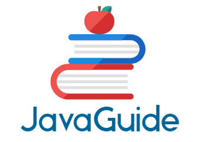
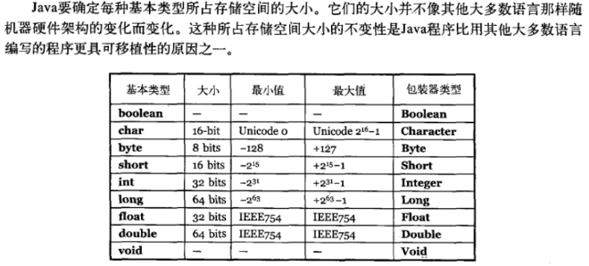
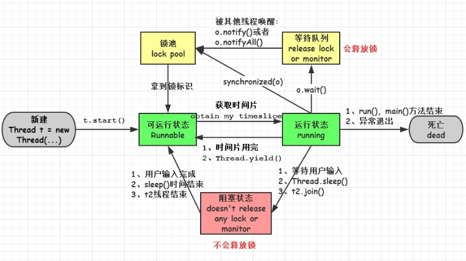

# pickup questions for java interview

## Java/J2EE 基础

- 面向对象和面向过程的区别？
- Java 语言有哪些特点？
- 什么是 JDK？ 什么是 JRE？ 什么是 JVM？ 三者之间的联系与区别？
- 占内存大小？

- 构造器 Constructor 是否可被 override？
- 重载和重写的区别？
- Java 面向对象编程三大特性？ （封装、继承、多态）
- String 和 StringBuffer、StringBuilder 的区别是什么？
- String 为什么是不可变的？
- == 与 equals(重要)？
- hashCode 与 equals（重要）
- Java 中的异常处理 （异常处理的最佳实践）？
- Java序列化中如果有些字段不想进行序列化，怎么办？  使用transient关键字修饰

## Java容器方面

- ArrayList和Vector的区别？
- HashMap和Hashtable的区别？
- Collection和Collections的区别？
- 说出ArrayList,LinkedList的存储性能和特性？
- Enumeration和Iterator接口的区别？

## Java并发方面

- 简述线程，程序、进程的基本概念。以及他们之间关系是什么？
- 线程有哪些基本状态？这些状态是如何定义的?

- 并发集合类是什么？
- 与Java集合框架相关的有哪些最好的实践？

## Java虚拟机方面

- 说一说JAVA虚拟机内存模型？
- 说一说JAVA中使用垃圾回收算法？
- CMS和G1了解么，CMS解决什么问题，说一下回收的过程？

## 设计模式

## 数据结构与算法

## 操作系统

## 主流框架/软件

### Spring

### ORM

### MVC

## 数据存储

### SQL

### NoSQL

## 架构

### 单片架构

### 分布式架构

### 微服务架构

