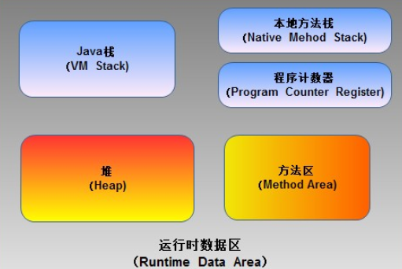
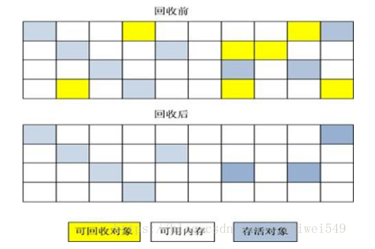
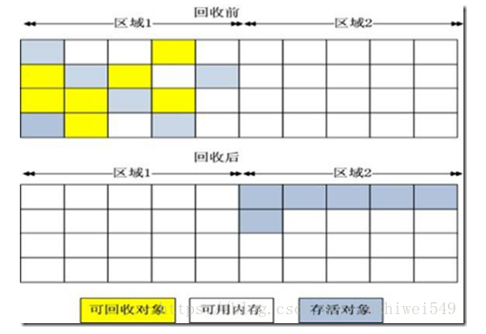
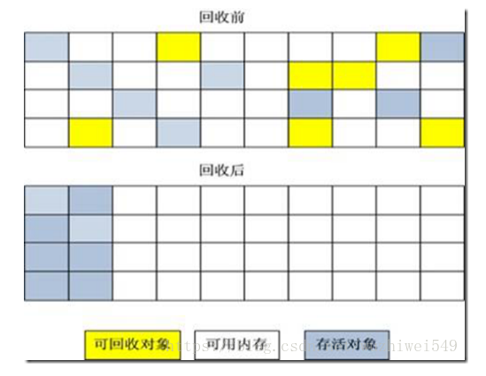
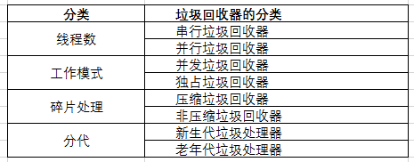

# More

## JAVA虚拟机内存模型

Java虚拟机内存模型是Java程序运行的基础。为了能使Java应用程序正常运行，JVM虚拟机将其内存数据分为：

- 程序计数器
- 虚拟机栈
- 本地方法栈
- Java 堆
- 方法区

[JVM的内存区域划分](https://www.cnblogs.com/dolphin0520/p/3613043.html)

## 垃圾收集基础

一个不合适的垃圾回收方法和策略会对系统性能造成不良影响。

### 垃圾回收算法和思想

- 引用计数法： 在Java的垃圾回收器，没有使用这种算法。

> 由于无法处理循环引用的问题，引用计数器不适合用于JVM的垃圾回收。

- 标记-清除算法 (Mark-Sweep)： 分为标记阶段和回收阶段。

> 标记-清除算法是现代垃圾回收算法的思想基础。标记-清除算法可能产生的最大问题就是空间碎片。

它的主要缺点有两个：

	（1）效率问题：标记和清除过程的效率都不高；
	（2）空间问题：标记清除之后会产生大量不连续的内存碎片，空间碎片太多可能会导致。

碎片过多会导致大对象无法分配到足够的连续内存，从而不得不提前触发GC，甚至Stop The World。

- 复制算法（Copying）

> 与标记-清除算法相比，复制算法是一种相对高效的回收方法。它的核心思想是：
> 
> 将原有的内存空间分为两块，每次只使用其中一块，在垃圾回收时，将正在使用的内存中的存活对象复制到未使用的内存块中；
> 在后，清除正在使用的内存块中的所有对象，交换两个内存的角色，完成垃圾回收。

它的主要缺点有两个：

    （1）效率问题：在对象存活率较高时，复制操作次数多，效率降低；
    （2）空间问题：內存缩小了一半；需要額外空间做分配担保(老年代)

在Java的新生代串行垃圾回收器中，使用了复制算法的思想。

- eden 空间
- from 空间
- to 空间

From Survivor, To Survivor使用的就是复制算法。老年代不使用这种算法！

	复制算法比较适用于新生代。因为在新生代，垃圾对象通常会多于存活对象，复制算法的效果会比较好。

- 标记-压缩算法 (Mark-Compact)

> 标记-压缩算法是一种**老年代**的回收算法，它在标记-清除算法的基础上做了一些优化。它的核心思想是：
> 
> 先后向需要从根节点开始、对所有可达对象做一次标记，然后将所有的存活对象压缩到内存的一端，之后，清理边界外所有的空间。

这种方法既避免了碎片的产生，又不需要两块相同的内存空间，因此，其性价比较高。

- 分代算法（Generational Collecting）

根据垃圾回收对象的特征，使用合适的算法回收，才是明智的选择。

> 分代就是基于这种思想，它将内存区间根据对象的特点分为几块，根据每块内存区间的特点，使用不同的回收算法，以提高垃圾回收的效率。

以Hot Spot虚拟机为例：

	它将所有的新建对象都放入年轻代的内存区域，年轻代的特点是：对象早生夕灭，大约90%的新建对象会被回收。	
	因此，在年轻代就选择效率比较高的复制算法。
	当一个对象经过几次回收后依然存活，对象就会被放入称为老年代的内存区间。
	在老年代中，几乎所有的对象都是经历几次垃圾回收后依然得以幸存的（常驻内存）。
	老年代的回收性价比要低于新生代，就不能使用复制算法，需要使用与新生代不同的标记-压缩算法，以提高垃圾回收效率。

- 增量算法（Incremental Collecting）

对于大部分的垃圾回收算法而言，在垃圾回收的过程中，应用软件将处于一种*Stop the world*的状态。

> 基本思想是：如果一次性将所有的垃圾进行处理，需要造成系统长时间的停顿，那么就可以让垃圾收集线程和应用程序线程交替执行。
> 每次，垃圾收集线程只收集一小片区域的内存空间，接着切换到应用程序线程。以此反复，直到垃圾收集完成。

其优缺点是：

	使用这种方式，由于在垃圾回收的过程中，间接性地执行应用程序代码，所以能减少系统的停顿时间。
	但是，因为线程切换和上下文转换的消耗，会使得垃圾回收的总体成本上升，造成系统吞吐量的下降。

[JVM的垃圾回收算法](https://blog.csdn.net/wuzhiwei549/article/details/80563134)

### 垃圾收集器的类型

- 在并行能力较强的CPU上，使用并行垃圾回收器可以缩短GC的停顿时间。
- 使用并发式垃圾回收器与应用程序线程交替工作，可以尽可能减少应用程序的停顿时间。

### 评价GC策略的指标

- 吞吐量
- 垃圾回收器负载
- 停顿时间
- 垃圾回收频率
- 反应时间
- 堆分配

根据应用的不同特点，可以选择不同的垃圾回收器，以提高应用程序的性能。

### 面试问题

1. Java对象的回收方式，回收算法。
2. CMS和G1了解么，CMS解决什么问题，说一下回收的过程。
3. CMS回收停顿了几次，为什么要停顿两次。
4. Java栈什么时候会发生内存溢出，Java堆呢，说一种场景，我说集合类持有对象。

