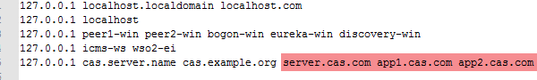

## CAS 5.3.x 学习

### 骨架搭建

#### 域名映射

修改/etc/hosts文件，添加服务端域名(server.cas.com) 以及两个客户端的域名(app1.cas.com , app2.cas.com) 

#### 编译

解压zip，命令行进去，执行mvn clean package 
结束之后会出现 target 文件夹，里面有一个cas.war包,这个war包就是我们要运行的程序。

####本地配置tomcat通过https访问

生成keystore

	keytool -genkey -alias tomcat -keyalg RSA -validity 3650 -keystore tomcat.keystore

具体介绍

	-alias tomcat ：表示秘钥库的别名是tomcat，实际操作都用别名识别，所以这个参数很重要。 
	-validity 3650 ： 表示证书有效期10年。 
	秘钥库口令 我输入的是 changeit 。 
	名字与姓氏输入服务器域名,其它一路回车，最后如果显示正确 输入 ‘y’ 就行了。 
	tomcat秘钥口令我采用与秘钥库相同，因此也是一路回车。 

之后可以使用以下命令查看生成秘钥库的文件内容：

	keytool -list -keystore tomcat.keystore 

根据keystore生成crt文件
	
	#输入第一步中keystore的密码changeit
	keytool -export -alias tomcat -file tomcat.cer -keystore tomcat.keystore -validity 3650

信任授权文件到JDK

	sudo keytool -import -keystore D:\flexdev\java\jdk1.8.0_131\jre\lib\security\cacerts -file tomcat.cer -alias tomcat -storepass changeit

证书库cacerts的缺省口令为changeit, 这也是为什么我上面的密码都是用的它, 防止混淆, 直接都设成一样的。 

删除授权文件命令如下，删除证书也需要输入密码：changeit

	sudo keytool -delete -alias tomcat -keystore D:\flexdev\java\jdk1.8.0_131\jre\lib\security\cacerts

查看cacerts中证书 命令如下：

	keytool -list -v -keystore D:\flexdev\java\jdk1.8.0_131\jre\lib\security\cacerts

修改tomcat的配置文件server.xml

    <Connector port="8443" protocol="org.apache.coyote.http11.Http11NioProtocol"
           maxThreads="200" SSLEnabled="true" scheme="https"
           secure="true" clientAuth="false" sslProtocol="TLS"
           keystoreFile="${catalina.base}/conf/certs/tomcat.keystore"
           keystorePass="changeit"/>

让chrome浏览器信任证书

#### 启动CAS服务

将第一步编译好的cas.war部署到tomcat中启动,然后访问如下的URL，如果提示签名不正确之类的就点击高级/详细信息，继续访问。 

	https://server.cas.com:8443/cas/login

#### 什么是Overlay

overlay可以把多个项目war合并成为一个项目，并且如果项目存在同名文件，那么主项目中的文件将覆盖掉其他项目的同名文件。使用maven 的Overlay配置实现无侵入的改造cas。

#### 使用Overlay生成真正有用的服务端

新建项目

	pom.xml

pom是从解压的cas.war中拷贝出来的，将无用的配置删除。

最终项目目录如下： 

	└─main
	    ├─java
	    └─resources
	        │  application.properties
	        │  log4j2.xml
	        │  thekeystore
	        │
	        ├─META-INF
	        │      spring.factories
	        │
	        └─services
	                Apereo-10000002.json
	                HTTPSandIMAPS-10000001.json

cas-overlay-template是采用配置覆盖的策略来进行自定义的，因此我们可以通过覆盖或者继承某些类重写某些方法实现自定义的需求。

其中application.properties和META-INF文件夹从 css.war 里面拷贝出来,还有log4j2.xml也是从cas.war中拷贝出来的,因为默认的日志生成位置是在/etc/cas/logs下,启动会报错。

修改application.properties

	server.ssl.enabled=true
	server.ssl.key-store=classpath:thekeystore
	server.ssl.key-store-password=changeit
	server.ssl.key-password=changeit
	server.ssl.keyAlias=tomcat

#### CAS自带的Tomcat

CAS自带的Tomcat，所以我们需要通过命令启动（与前面使用电脑自带Tomcat不同）

Windows：

打包命令：

	build.cmd package

运行命令：

	build.cmd run

当然你还可以使用如下的命令, 直接运行已经打包好的cas.war来运行CAS。

	java -jar cas.war

### JDBC认证

#### 数据库表的准备

第一步：建表sql

表结构使用的是之前shiro用户表

	DROP TABLE IF EXISTS `user_info`;
	CREATE TABLE `user_info` (
	  `uid` int(11) NOT NULL AUTO_INCREMENT,
	  `username` varchar(50) DEFAULT '' COMMENT '用户名',
	  `password` varchar(256) DEFAULT NULL COMMENT '登录密码',
	  `name` varchar(256) DEFAULT NULL COMMENT '用户真实姓名',
	  `id_card_num` varchar(256) DEFAULT NULL COMMENT '用户身份证号',
	  `state` char(1) DEFAULT '0' COMMENT '用户状态：0:正常状态,1：用户被锁定',
	  PRIMARY KEY (`uid`),
	  UNIQUE KEY `username` (`username`) USING BTREE,
	  UNIQUE KEY `id_card_num` (`id_card_num`) USING BTREE
	) ENGINE=InnoDB AUTO_INCREMENT=4 DEFAULT CHARSET=utf8;

第二步：插入密码为明文的一条记录

	INSERT INTO user_info(uid,username,`password`,`name`,id_card_num) VALUES (null,'admin','123456','超哥','133333333333333333');

第三步：pom添加依赖

	<dependency>
	    <groupId>org.apereo.cas</groupId>
	    <artifactId>cas-server-support-jdbc</artifactId>
	    <version>${cas.version}</version>
	</dependency>
	<dependency>
	    <groupId>org.apereo.cas</groupId>
	    <artifactId>cas-server-support-jdbc-drivers</artifactId>
	    <version>${cas.version}</version>
	</dependency>
	<dependency>
	    <groupId>mysql</groupId>
	    <artifactId>mysql-connector-java</artifactId>
	    <version>5.1.36</version>
	</dependency>

第四步：将默认的静态用户名和密码配置注释掉

	cas.authn.accept.users=casuser::Mellon

#### 添加jdbc认证的配置

	#添加jdbc认证
	cas.authn.jdbc.query[0].sql=SELECT * FROM user_info WHERE username =?
	#那一个字段作为密码字段
	cas.authn.jdbc.query[0].fieldPassword=password
	#配置数据库连接
	cas.authn.jdbc.query[0].url=jdbc:mysql://127.0.0.1:3306/test?useUnicode=true&characterEncoding=UTF-8&autoReconnect=true&useSSL=false
	cas.authn.jdbc.query[0].dialect=org.hibernate.dialect.MySQLDialect
	#数据库用户名
	cas.authn.jdbc.query[0].user=root
	#数据库密码
	cas.authn.jdbc.query[0].password=123456
	#mysql驱动
	cas.authn.jdbc.query[0].driverClass=com.mysql.jdbc.Driver

现在启动程序,使用admin/123456登录成功，可以从数据库获取信息登录，但是一般情况,是不会直接在数据库中存储明文密码的,下面我们来配置MD5加密。

#### 添加MD5加密配置

	#配置加密策略
	cas.authn.jdbc.query[0].passwordEncoder.type=DEFAULT
	cas.authn.jdbc.query[0].passwordEncoder.characterEncoding=UTF-8
	cas.authn.jdbc.query[0].passwordEncoder.encodingAlgorithm=MD5

这个时候再次使用账号admin 密码123456登录已经无法认证通过了,将123456的MD5密文e10adc3949ba59abbe56e057f20f883e放入数据库,这个时候再登录就可以了。

#### 对密码进行盐值处理(推荐)

上一步只是对密码进行了简单的加密，两个帐号有可能相同的值，就能判断出密码是一致的，但通过此方案，大大增加了难度，所以安全系数也高了许多，推荐使用策略。 

在上面的基础上，再添加如下代码(可以共存)：
	
	#加密迭代次数
	cas.authn.jdbc.encode[0].numberOfIterations=2
	#该列名的值可替代上面的值，但对密码加密时必须取该值进行处理
	cas.authn.jdbc.encode[0].numberOfIterationsFieldName=
	#盐值固定列
	cas.authn.jdbc.encode[0].saltFieldName=username
	#静态盐值
	cas.authn.jdbc.encode[0].staticSalt=.
	cas.authn.jdbc.encode[0].sql=SELECT * FROM user_info WHERE username =?
	#对处理盐值后的算法
	cas.authn.jdbc.encode[0].algorithmName=MD5
	cas.authn.jdbc.encode[0].passwordFieldName=password
	cas.authn.jdbc.encode[0].expiredFieldName=expired
	cas.authn.jdbc.encode[0].disabledFieldName=disabled
	#数据库连接
	cas.authn.jdbc.encode[0].url=jdbc:mysql://127.0.0.1:3306/test?useUnicode=true&characterEncoding=UTF-8&autoReconnect=true&useSSL=false
	cas.authn.jdbc.encode[0].dialect=org.hibernate.dialect.MySQL5Dialect
	cas.authn.jdbc.encode[0].driverClass=com.mysql.jdbc.Driver
	cas.authn.jdbc.encode[0].user=root
	cas.authn.jdbc.encode[0].password=123456

注意：如果两种方式都配置的话,默认先用普通MD5验证，如果验证失败，打印异常日志, 然后再使用加盐方式验证。

往数据库中再插入一条记录

	#密码是通过上面的PasswordSaltTest 生成的
	INSERT INTO user_info(uid,username,`password`,`name`,id_card_num) 
	VALUES (null,'test','ed0290f05224a188160858124a5f5077',
			'超哥哥','166666666666666666');

测试结果

	使用admin/123456登录成功(普通MD5可用) 
	使用test/123456登录成功(加盐密码可用)