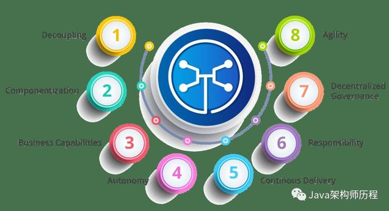

##进大厂必须掌握的50个微服务面试问题

### Q01 您对微服务有何了解？

微服务，又称**微服务架构**，是一种**架构风格**，它将应用程序构建为*以业务领域为模型*的小型自治服务集合。

微服务的蜂窝表示:

这里，每个六边形形状代表单独的服务组件。与蜜蜂的工作类似，每个敏捷团队都使用可用的框架和所选的技术堆栈构建单独的服务组件。就像在蜂箱中一样，每个服务组件形成一个强大的微服务架构，以提供更好的可扩展性。此外，敏捷团队可以单独处理每个服务组件的问题，而对整个应用程序没有影响或影响最小。

### Q02 微服务架构有哪些优势？

- **独立开发** 所有微服务都可以根据各自的功能轻松开发
- **独立部署** 基于其服务，可以在任何应用程序中单独部署它们
- **故障隔离** 即使应用程序的一项服务不起作用，系统仍可继续运行
- **混合技术堆栈** 可以使用不同的语言和技术来构建同一应用程序的不同服务
- **粒度缩放** 单个组件可根据需要进行缩放，无需将所有组件缩放在一起

### Q03 微服务有哪些特点？

- **解耦** 系统内的服务很大程度上是分离的。因此，整个应用程序可以轻松构建，更改和扩展
- **组件化** 微服务被视为可以轻松更换和升级的独立组件
- **业务能力** 微服务非常简单，专注于单一功能
- **自治** 开发人员和团队可以彼此独立工作，从而提高速度
- **持续交付** 通过软件创建，测试和批准的系统自动化，允许频繁发布软件
- **责任** 微服务不关注应用程序作为项目。相反，他们将应用程序视为他们负责的产品
- **分散治理** 重点是使用正确的工具来做正确的工作。
- **敏捷** 微服务支持敏捷开发。任何新功能都可以快速开发并再次丢弃

这意味着**没有标准化模式或任何技术模式**。开发人员可以自由选择最有用的工具来解决他们的问题。

### Q04 设计微服务的最佳实践是什么？

### Q05 微服务架构如何运作？

### Q30 PACT在微服务架构中的用途是什么？

PACT是一个开源工具，允许测试服务提供者和消费者之间的交互，使用契约保持隔离，从而提高微服务集成的可靠性。

微服务中的用法：

- 用于在微服务中实现消费者驱动的契约。
- 测试微服务的消费者和提供者之间的消费者驱动的契约。

### Q31 什么是OAuth？

OAuth 代表**开放授权协议**。这允许通过在HTTP服务上启用客户端应用程序（例如第三方提供商Facebook，GitHub等）来访问资源所有者的资源。因此，您可以在不使用其凭据的情况下与另一个站点共享存储在一个站点上的资源。

### Q32 康威定律是什么？

“任何设计系统的组织（广泛定义）都将产生一种设计，其结构是组织通信结构的副本。” - Mel Conway

该定律基本上试图传达这样一个事实：

- 为了使软件模块起作用，整个团队应该进行良好的沟通。因此，系统的结构反映了产生它的组织的社会边界。

### Q33 契约测试你懂什么？

根据Martin Flower的说法，契约测试是在外部服务边界进行的测试，用于验证其是否符合消费服务预期的契约。

此外，契约测试不会深入测试服务的行为。更确切地说，它测试该服务调用的**输入＆输出**包含所需的属性和所述**响应延迟**，**吞吐量**是允许的限度内。

### Q34 什么是端到端微服务测试？

**端到端测试**验证了工作流中的每个流程都正常运行。这可确保系统作为一个整体**协同**工作并满足所有要求。

通俗地说，你可以说端到端测试是一种测试，在特定时期后测试所有东西。

### Q35 Container在微服务中的用途是什么？

**容器**是管理基于微服务的应用程序以便单独开发和部署它们的好方法。您可以将微服务封装在容器映像及其依赖项中，然后可以使用它来**按需滚动**微服务的实例，而无需任何额外的工作。

### Q36 什么是微服务架构中的DRY？

DRY (Don't Repeat Yourself ) 代表**不要重复自己**。

它基本上**促进了重用代码**的概念。这导致开发和共享库，这反过来导致紧密耦合。

### Q37 什么是消费者驱动的契约（CDC）？

这基本上是用于开发微服务的模式，以便它们可以被外部系统使用。当我们处理微服务时，有一个特定的**提供者**构建它，并且有一个或多个使用微服务的**消费者**。

通常，提供程序在XML文档中指定接口。但在消费者驱动的合同中，每个服务消费者都传达了提供者期望的接口。

### Q38 Web (RESTful) API在微服务中的作用是什么？

微服务架构基于一个**概念**，其中所有服务应该能够彼此交互以构建业务功能。因此，要实现这一点，**每个微服务必须具有接口**。这使得Web API成为微服务的一个非常重要的推动者。

RESTful API基于Web的开放网络原则，为构建微服务架构的各个组件之间的接口提供了**最合理的模型**。

### Q39 您对微服务架构中的语义监控有何了解？

语义监控，也称为**综合监控**， 将自动化测试与监控应用程序相结合，以检测业务失败因素。

### Q40 我们如何进行跨功能测试？

跨功能测试是对**非功能性**需求的验证，即那些无法像普通功能那样实现的需求。

### Q41 我们如何在测试中消除非决定论？

**非确定性测试（NDT）**基本上是**不可靠**的测试。所以，有时可能会发生它们通过，显然有时它们也可能会失败。当它们失败时，它们会重新运行通过。

从测试中删除非确定性的一些方法如下：

- 隔离
- 异步
- 远程服务
- 隔离
- 时间
- 资源泄漏

### Q42 Mock或Stub有什么区别？

> Mock

- 一个有助于运行测试的虚拟对象。
- 在某些可以硬编码的条件下提供固定行为。
- 永远不会测试存根的任何其他行为。

> Stub

- 一个虚拟对象，其中最初设置了某些属性。
- 此对象的行为取决于set属性。
- 也可以测试对象的行为。

### Q43 您对Mike Cohn的测试金字塔了解多少？

**Mike Cohn** 提供了一个名为Test Pyramid的模型。这描述了软件开发所需的自动化测试类型。

- 根据金字塔（如上图），第一层的测试数量应该最高。
- 在服务层，测试次数应小于单元测试级别，但应大于端到端级别。

### Q44 Docker的目的是什么？

**Docker** 提供了一个可用于**托管**任何应用程序的**容器环境**。在此，软件应用程序和支持它的依赖项紧密打包在一起。

因此，这个打包的产品被称为Docker镜像，因为它是由Docker完成的，所以它的运行实例被称为Docker容器！

### Q45 什么是金丝雀发布？

**Canary Releasing**是一种降低在生产中引入新软件版本的风险的技术。这是通过将变更缓慢地推广到一小部分用户，然后将其发布到整个基础架构，即将其提供给每个人来完成的。

### Q46 什么是持续集成（CI）？

**持续集成（CI）**是每次团队成员提交版本控制更改时自动构建和测试代码的过程。这鼓励开发人员通过在每个小任务完成后将更改合并到共享版本控制存储库来共享代码和单元测试。

### Q47 什么是持续监测？

**持续监控**深入监控覆盖范围，从浏览器内前端性能指标，到应用程序性能，再到主机虚拟化基础架构指标。

### Q48 架构师在微服务架构中的角色是什么？

微服务架构中的架构师扮演以下角色：

- 决定整个软件系统的布局。
- 帮助确定组件的分层。因此，他们确保组件相互关系，以及不紧密耦合。
- 与开发人员共同编写代码，了解日常生活中面临的挑战。
- 为开发微服务的团队提供某些工具和技术的建议。
- 提供技术治理，以便技术开发团队遵循微服务原则。

### Q49 我们可以用微服务创建状态机吗？

我们知道拥有自己的数据库的每个微服务都是一个**可独立部署的程序单元**，这反过来又让我们可以创建一个**状态机**。因此，我们可以为特定的微服务指定不同的状态和事件。

例如，我们可以定义Order微服务, 订单可以具有不同的状态; Order状态的转换可以是Order微服务中的独立事件。

### Q50 什么是微服务中的反应性扩展？

Reactive Extensions也称为Rx。这是一种设计方法，我们**通过调用多个服务来收集结果，然后编译组合响应**。

这些调用可以是**同步或异步，阻塞或非阻塞**。Rx是分布式系统中非常流行的工具，与传统流程相反。