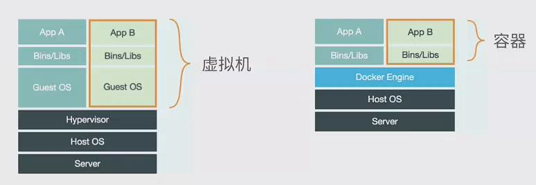
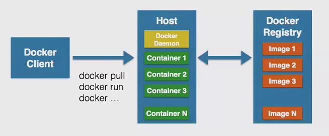
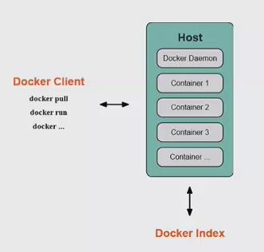
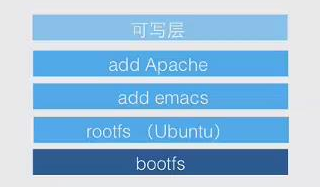

# learnning docker

## Docker 基本命令

### Docker版本

	[mac@node4 ~]$ docker version
	Client:
	 Version:         1.13.1
	 API version:     1.26
	 Package version: docker-1.13.1-96.gitb2f74b2.el7.centos.x86_64
	 Go version:      go1.10.3
	 Git commit:      b2f74b2/1.13.1
	 Built:           Wed May  1 14:55:20 2019
	 OS/Arch:         linux/amd64
	
	Server:
	 Version:         1.13.1
	 API version:     1.26 (minimum version 1.12)
	 Package version: docker-1.13.1-96.gitb2f74b2.el7.centos.x86_64
	 Go version:      go1.10.3
	 Git commit:      b2f74b2/1.13.1
	 Built:           Wed May  1 14:55:20 2019
	 OS/Arch:         linux/amd64
	 Experimental:    false
	[mac@node4 ~]$ 

### 镜像相关的

	[mac@master ~]$ docker image help
	
	Usage:  docker image COMMAND
	
	Manage images
	
	Options:
	      --help   Print usage
	
	Commands:
	  build       Build an image from a Dockerfile
	  history     Show the history of an image
	  import      Import the contents from a tarball to create a filesystem image
	  inspect     Display detailed information on one or more images
	  load        Load an image from a tar archive or STDIN
	  ls          List images
	  prune       Remove unused images
	  pull        Pull an image or a repository from a registry
	  push        Push an image or a repository to a registry
	  rm          Remove one or more images
	  save        Save one or more images to a tar archive (streamed to STDOUT by default)
	  tag         Create a tag TARGET_IMAGE that refers to SOURCE_IMAGE
	
	Run 'docker image COMMAND --help' for more information on a command.
	[mac@master ~]$ 

### 容器相关的

	[mac@master ~]$ docker container help
	
	Usage:  docker container COMMAND
	
	Manage containers
	
	Options:
	      --help   Print usage
	
	Commands:
	  attach      Attach to a running container
	  commit      Create a new image from a container's changes
	  cp          Copy files/folders between a container and the local filesystem
	  create      Create a new container
	  diff        Inspect changes on a container's filesystem
	  exec        Run a command in a running container
	  export      Export a container's filesystem as a tar archive
	  inspect     Display detailed information on one or more containers
	  kill        Kill one or more running containers
	  logs        Fetch the logs of a container
	  ls          List containers
	  pause       Pause all processes within one or more containers
	  port        List port mappings or a specific mapping for the container
	  prune       Remove all stopped containers
	  rename      Rename a container
	  restart     Restart one or more containers
	  rm          Remove one or more containers
	  run         Run a command in a new container
	  start       Start one or more stopped containers
	  stats       Display a live stream of container(s) resource usage statistics
	  stop        Stop one or more running containers
	  top         Display the running processes of a container
	  unpause     Unpause all processes within one or more containers
	  update      Update configuration of one or more containers
	  wait        Block until one or more containers stop, then print their exit codes
	
	Run 'docker container COMMAND --help' for more information on a command.
	[mac@master ~]$ 

### 所有相关的

	[mac@master ~]$ docker 
	
	Usage:  docker COMMAND
	
	A self-sufficient runtime for containers
	
	Options:
	      --config string      Location of client config files (default "/home/mac/.docker")
	  -D, --debug              Enable debug mode
	      --help               Print usage
	  -H, --host list          Daemon socket(s) to connect to (default [])
	  -l, --log-level string   Set the logging level ("debug", "info", "warn", "error", "fatal") (default "info")
	      --tls                Use TLS; implied by --tlsverify
	      --tlscacert string   Trust certs signed only by this CA (default "/home/mac/.docker/ca.pem")
	      --tlscert string     Path to TLS certificate file (default "/home/mac/.docker/cert.pem")
	      --tlskey string      Path to TLS key file (default "/home/mac/.docker/key.pem")
	      --tlsverify          Use TLS and verify the remote
	  -v, --version            Print version information and quit
	
	Management Commands:
	  container   Manage containers
	  image       Manage images
	  network     Manage networks
	  node        Manage Swarm nodes
	  plugin      Manage plugins
	  secret      Manage Docker secrets
	  service     Manage services
	  stack       Manage Docker stacks
	  swarm       Manage Swarm
	  system      Manage Docker
	  volume      Manage volumes
	
	Commands:
	  attach      Attach to a running container
	  build       Build an image from a Dockerfile
	  commit      Create a new image from a container's changes
	  cp          Copy files/folders between a container and the local filesystem
	  create      Create a new container
	  diff        Inspect changes on a container's filesystem
	  events      Get real time events from the server
	  exec        Run a command in a running container
	  export      Export a container's filesystem as a tar archive
	  history     Show the history of an image
	  images      List images
	  import      Import the contents from a tarball to create a filesystem image
	  info        Display system-wide information
	  inspect     Return low-level information on Docker objects
	  kill        Kill one or more running containers
	  load        Load an image from a tar archive or STDIN
	  login       Log in to a Docker registry
	  logout      Log out from a Docker registry
	  logs        Fetch the logs of a container
	  pause       Pause all processes within one or more containers
	  port        List port mappings or a specific mapping for the container
	  ps          List containers
	  pull        Pull an image or a repository from a registry
	  push        Push an image or a repository to a registry
	  rename      Rename a container
	  restart     Restart one or more containers
	  rm          Remove one or more containers
	  rmi         Remove one or more images
	  run         Run a command in a new container
	  save        Save one or more images to a tar archive (streamed to STDOUT by default)
	  search      Search the Docker Hub for images
	  start       Start one or more stopped containers
	  stats       Display a live stream of container(s) resource usage statistics
	  stop        Stop one or more running containers
	  tag         Create a tag TARGET_IMAGE that refers to SOURCE_IMAGE
	  top         Display the running processes of a container
	  unpause     Unpause all processes within one or more containers
	  update      Update configuration of one or more containers
	  version     Show the Docker version information
	  wait        Block until one or more containers stop, then print their exit codes
	
	Run 'docker COMMAND --help' for more information on a command.
	[mac@master ~]$ 

### 技巧

删除所有退出状态的容器

	docker rm -v $(docker ps -aq -f status=exited) 

## Docker的基本概念

假如启动一个Ubuntu镜像：

	$ sudo docker run -i -t ubuntu /bin/bash
	root@b066e4208a4e:/# ls

	root@b066e4208a4e:/# ps

	root@b066e4208a4e:/# ifconfig

#### Docker Registry 仓库

- 公有
- 私有
- Docker Hub

执行如下的命令，来安装一个本地的仓库

	[mac@node4 ~]$ docker run -d -p 5000:5000 --restart=always --name registry registry:2

或者指定一个挂载的本地路径

	[mac@node4 ~]$ docker run -d -p 5000:5000 -v /myregistry:/var/lib/registry --restart=always --name registry registry:2
	c195c84047b3d308d28a2bac1b07a110f40cf687386af37cd5ce68c3addc7e1e
	[mac@node4 ~]$ 

查看docker进程

	[mac@node4 ~]$ docker ps
	CONTAINER ID        IMAGE               COMMAND                  CREATED             STATUS              PORTS                    NAMES
	c195c84047b3        registry:2          "/entrypoint.sh /e..."   6 seconds ago       Up 4 seconds        0.0.0.0:5000->5000/tcp   registry
	[mac@node4 ~]$ 

执行如下命令，登录DockerHub

	[mac@node4 docker_demo]$ docker login -u badmac
	Password: Bu*******DOCKER
	Login Succeeded
	[mac@node4 docker_demo]$ 

#### Try it

Start the Tutorial of Docker:

	$ docker version
	$ docker search tutorial
	$ docker pull learn/tutorial
	$ docker run learn/tutorial echo 'hello world'
	$ docker run learn/tutorial apt-get install -y ping
	$ docker ps -l
	$ docker commit 69******422  learn/ping
	$ docker run learn/ping ping www.baidu.com
    $ docker ps
    $ docker inspect ef*****d5 (container id of learn/ping)
	$ docker images
	$ docker push learn/ping

### Docker容器的相关技术简介

Docker 依赖的Linux内核特性：

- Namespaces 命名空间
- Control Groups （cgroup） 控制组

#### Namespaces 命名空间

命名空间术语来源于编程语言： 封装 --> 代码隔离

对于操作系统而言： 系统资源的隔离，进程、网络、文件系统...

- PID 进程隔离
- NET 网络隔离
- IPC 管理跨进程的访问
- MNT 管理挂载点
- UTS 隔离内核和版本标识

#### Control Groups 控制组

用来分配资源，该技术来源于google，首先出现在Linux kernel 2.6.24 @2007 

- 资源限制
- 优先级设定
- 资源计量
- 资源控制

#### Docker容器的能力

- 文件系统隔离： 每个容器都有自己的root文件系统
- 进程隔离： 每个容器都运行在自己的进程环境中
- 网络隔离： 容器间的虚拟网络接口和IP地址都是分开的
- 资源隔离和分组：使用cgroups将CPU和内存之类的资源独立分配给每个Docker容器

## Docker的安装和部署

## 常用Docker操作实战

### 初识Docker

#### 什么是Docker

Docker是基于go语言实现的云开源项目，诞生于2013年初，最初发起者：dotCloud

- 将应用程序自动部署到容器
- 使用Go语言，Go语言开源引擎： [https://github.com/docker](https://github.com/docker)
- 2013年初由  dotCloud 开发
- 基于Apache 2.0 开源授权协议发行

Docker的目标：

- 提供简单轻量级的建模方式
- 职责的逻辑分离
- 快速高效的开发生命周期
- 鼓励使用面向服务的架构

##### Linux容器技术

> Docker引擎的基础是Linux容器技术（LXC）

什么是容器？

- 一种虚拟化的方案
- 操作系统级别的虚拟化
- 只能运行相同或者类似的操作系统
- 依赖于Linux内核特性： Namespace和Cgroups

##### 从Linux容器到Docker

可以简单地将Docker容器理解成为一种沙箱（sandbox）。

- 每个容器内运行一个应用，不同的容器相互隔离，容器之间也可以建立通信机制。

#### 为什么要使用Docker

##### Docker容器虚拟化的好处

高效地构建应用，通过容器打包应用。

Docker的使用场景：

1. 使用Docker容器开发、测试、部署服务
2. 创建隔离带运行环境
3. 搭建测试环境
4. 构建多用户的**平台即服务**（PaaS）基础设施
5. 提供**软件即服务**（SaaS）的应用程序
6. 高性能、超大规模的宿主机部署

##### Docker在开发和运维中的优势

对开发和运维（DevOps）人员来说，就是梦寐以求的一次性地创建或者配置，可以在任意环境、任意时间让应用正常地运行。

- 更快速度的交付和部署
- 更高效的资源利用
- 更轻松的迁移和扩展
- 更简单的更新管理

##### Docker与虚拟机比较

作为一种轻量级的虚拟化方式，Docker在运行应用上跟传统的虚拟机方式相比具有显著的优势：

- Docker容器很快、启动和停止可以在秒级实现。
- Docker容器对系统资源需要很少，一台主机可以同时运行数千个的Docker容器。
- Docker通过类似Git的操作来方便用户获取、分发和更新应用镜像，指令简单，学习成本较低。
- Docker通过Dockerfile配置文件来支持灵活的自动化创建和部署机制，提高工作效率。

传统虚拟机方式**运行N个不同的应用就要启动N个虚拟机**（每个虚拟机需要单独分配独占的内存、磁盘资源）；而Docker只需要启动N个隔离的容器，并将应用放到容器即可。

#### 虚拟化与Docker

计算机虚拟化： 通常说的是服务器虚拟化 

- Virtualiaztion
- 大致上分为：基于硬件的虚拟化和基于软件的虚拟化
- 基于软件的虚拟化从对象所在的层次，又可以分为**应用虚拟化**和**平台虚拟化**（通常所说的虚拟机）

Linux容器技术 vs 虚拟机：

### Docker的核心概念和安装

#### 核心概念

> Docker的基本组成

> Docker是C/S架构

- Docker Client 客户端
- Docker Daemon 守护进程
- Docker Image 镜像
- Docker Container 容器
- Docker Registry 仓库

Docker客户端/守护进程： 本地/远程

#### 安装Docker

##### CentOS 下安装

[https://docs.docker.com/install/linux/docker-ce/centos/](https://docs.docker.com/install/linux/docker-ce/centos/ "Get Docker CE for CentOS")

Uninstall old versions

	$ sudo yum remove docker \
	                  docker-client \
	                  docker-client-latest \
	                  docker-common \
	                  docker-latest \
	                  docker-latest-logrotate \
	                  docker-logrotate \
	                  docker-selinux \
	                  docker-engine-selinux \
	                  docker-engine

SET UP THE REPOSITORY 1

	$ sudo yum install -y yum-utils \
	  device-mapper-persistent-data \
	  lvm2

SET UP THE REPOSITORY 2

	sudo yum-config-manager \
	    --add-repo \
	    https://download.docker.com/linux/centos/docker-ce.repo

INSTALL DOCKER CE

	$ yum makecache fast
	$ yum list docker-ce.x86_64  --showduplicates |sort -r
	$ sudo yum install docker-ce-18.06.1.ce-3.el7 （具体的版本）

或者安装最新版本：
	$ sudo yum install docker-ce  （安装最新版本：18.09.1）

##### Ubuntu 下安装

安装Ubuntu维护的版本

	$ sudo apt-get install docker.io
	$ source /etc/bash_completion.d/docker.io

安装Docker维护的版本:

	$ sudo apt-get install -y curl
	$ curl -fsSL https://get.docker.com -o get-docker.sh | sudo sh get-docker.sh

##### 安装后配置的修改

安装docker后，docker默认镜像地址是国外docker官网地址，由于国内网速的原因，下载镜像非常慢，且容易断网，所以安装docker 后我们一般需要将docker改成国内的镜像地址，其方法如下：

	1、	vi /etc/docker/daemon.json
	{
	    "registry-mirrors":["https://registry.docker-cn.com"]
	}

	2、加载docker镜像配置 
	systemctl daemon-reload 

	3、重启docker服务
	systemctl restart docker.service

推荐官方镜像, 不需要注册的：

	Docker中国区官方镜像： 
	https://registry.docker-cn.com
	网易蜂巢:
	http://hub-mirror.c.163.com

需要注册，根据帐号修改xxxx内容:

	阿里镜像:
	https://xxxx.mirror.aliyuncs.com 
	DaoCloud:
	http://xxxx.m.daocloud.ip

##### 安装后的检查

检查Docker信息

	$ docker -v
	Docker version 18.09.1, build 4c52b90
	docker info
	Cannot connect to the Docker daemon at unix:///var/run/docker.sock. Is the docker daemon running?

问题解决：

    systemctl enable docker && systemctl start docker

重新检查：

	$ sudo docker version
		Client:
		 Version:           18.09.1
		 API version:       1.39
		 Go version:        go1.10.6
		 Git commit:        4c52b90
		 Built:             Wed Jan  9 19:35:31 2019
		 OS/Arch:           linux/amd64
		 Experimental:      false
		
		Server: Docker Engine - Community
		 Engine:
		  Version:          18.09.1
		  API version:      1.39 (minimum version 1.12)
		  Go version:       go1.10.6
		  Git commit:       4c52b90
		  Built:            Wed Jan  9 19:02:44 2019
		  OS/Arch:          linux/amd64
		  Experimental:     false

连接远程的docker主机

	[mac@master ~]$ docker -H 192.168.0.112 info
	Cannot connect to the Docker daemon at tcp://192.168.0.112:2375. Is the docker daemon running?

问题解决：

	sudo vi /etc/systemd/system/multi-user.target.wants/docker.service 

	在 ExecStart=/usr/bin/dockerd-current 后面追加：

	ExecStart=/usr/bin/dockerd-current -H tcp://0.0.0.0:2375 -H unix:///var/run/docker.sock \
 

	或者将管理地址写入 /etc/profile   
	$ echo 'export DOCKER_HOST=tcp://0.0.0.0:2375' >> /etc/profile
	$ source /etc/profile

重启Docker:
	
	$ sudo systemctl daemon-reload
	$ sudo systemctl restart docker.service

重新测试：

	[mac@master ~]$ docker -H 192.168.0.112 info
	Containers: 2
	 Running: 0
	 Paused: 0
	 Stopped: 2
	Images: 6
	Server Version: 1.13.1

测试一个Ubuntu镜像：

	mac@ubuntu:~$ 
	mac@ubuntu:~$ sudo docker run ubuntu echo 'hello world'
	Unable to find image 'ubuntu:latest' locally
	latest: Pulling from library/ubuntu
	84ed7d2f608f: Pull complete 
	be2bf1c4a48d: Pull complete 
	a5bdc6303093: Pull complete 
	e9055237d68d: Pull complete 
	Digest: sha256:868fd30a0e47b8d8ac485df174795b5e2fe8a6c8f056cc707b232d65b8a1ab68
	Status: Downloaded newer image for ubuntu:latest
	hello world
	mac@ubuntu:~$ 

如何避免不使用sudo （增加docker的用户组，并且把当前用户添加到该组中，然后重启docker服务）：

	$ sudo groupadd docker
	groupadd: group 'docker' already exists
	$ sudo gpasswd -a mac docker
	Adding user mac to group docker
	$ sudo service docker restart
	$ 
	$ docker version
	Client:
	 Version:           18.09.1
	 API version:       1.39
	 Go version:        go1.10.6
	 Git commit:        4c52b90
	 Built:             Wed Jan  9 19:35:31 2019
	 OS/Arch:           linux/amd64
	 Experimental:      false
	Got permission denied while trying to connect to the Docker daemon socket at unix:///var/run/docker.sock: Get http://%2Fvar%2Frun%2Fdocker.sock/v1.39/version: dial unix /var/run/docker.sock: connect: permission denied
	mac@ubuntu:~$ 

或者：

	[mac@node4 ~]$ who am i
	mac      pts/0        2019-07-16 15:14 (192.168.0.105)
	[mac@node4 ~]$ 
	[mac@node4 ~]$ sudo usermod -aG docker ${USER}
	usermod：“docker”组不存在
	[mac@node4 ~]$ 
	[mac@node4 ~]$ sudo groupadd docker
	[mac@node4 ~]$ 
	[mac@node4 ~]$ echo ${USER}
	mac
	[mac@node4 ~]$ sudo usermod -aG docker ${USER}
	[mac@node4 ~]$ 

依旧出现错误，需要注销用户并且重新登录。

#### 演示环境说明

### 镜像

#### Docker Image 镜像

- 容器的基石
- 层叠的只读文件系统
- 联合加载 （union mount） 

#### 获取镜像

> 镜像是Docker运行容器的前提

可以使用如下的命令从网络下载镜像：

	docker pull ubuntu
	docker pull ubuntu:16:04
	docker pull dl.dockerpool.com:5000/ubuntu

下载镜像到本地后，即可使用该镜像，下面的命令创建一个容器：

	docker run -i -t ubuntu /bin/bash

配置软件源
	apt-get update

#### 查看镜像

可以使用如下的命令列出本地主机上已有的镜像：

	docker images

	REPOSITORY	TAG		IMAGE ID		CREATED			SIZE
	ubuntu      latest  1d9c17228a9e	4 weeks ago		86.7MB

Tag信息用来标记来自同一仓库的不同镜像。

使用如下的命令来获取某个镜像的详细信息(JSON格式)：

	docker inspect imageId
	[{
		...
	}]

	docker inspect -f {{.Architecture""}} imageId
	docker inspect -f {{."Architecture"}} 1d9c17228a9e
	amd64

如何查看镜像支持的环境变量？

	$docker run badmac/apache:latest env
	$ docker run 0eaa6e18e604 env
	PATH=/usr/local/sbin:/usr/local/bin:/usr/sbin:/usr/bin:/sbin:/bin
	HOSTNAME=e47ef2044cfe
	DEBIAN_FRONTEND=noninteractive
	APACHE_RUN_USER=www-data
	APACHE_RUN_GROUP=www-data
	APACHE_LOG_DIR=/var/log/apache2
	APACHE_PID_FILE=/var/run/apache2.pid
	APACHE_RUN_DIR=/var/run/apache2
	APACHE_LOCK_DIR=/var/lock/apache2
	APACHE_SERVERADMIN=admin@localhost
	APACHE_SERVERNAME=localhost
	APACHE_SERVERALIAS=docker.localhost
	APACHE_DOCUMENTROOT=/var/www
	HOME=/root

#### 搜寻镜像

使用如下的命令可以搜索远端仓库中共享的镜像：

	docker search mysql

支持的参数：

- --automated=false
- --no-trunc=false
- --stars = 0 (-s)

默认的输出结果将按星级评价进行排序。

#### 删除镜像

使用镜像的标签删掉镜像：

	docker rmi imageTag
	docker rmi imageId
	docker rmi imageId1 imageId2
	docker rmi ubuntu:12.04 ubuntu:14:04

因为多个标签可以共享一个镜像，当镜像只剩下一个标签的时候就要小心了，此时再使用rmi命令会彻底删掉该镜像。

使用docker ps -a 查看本机上存在的所有容器：

	docker ps -a

如果后台存在一个退出状态的容器，试图删掉该镜像，Docker会提示有容器正在运行，无法删掉; 此时可以使用-f参数：
	
	docker rmi -f tagId

不推荐使用-f参数来强制删除一个存在容器依赖的镜像，因为这样往往会造成一些遗留问题。

- 正确的做法： 先删除依赖该镜像的所有容器，再来删除镜像。

如何批量清除临时镜像文件？

	docker rmi $(docker images -f "dangling=true" -q)

删掉所有关于ubuntu的镜像：

	$ docker images ubuntu -q
	0eaa6e18e604
	1146ff2e25a7
	c4b905c73d57
	...
	$ docker rmi $(docker images ubuntu -q)

#### 创建镜像

创建镜像的方法有三种：

- 基于已有镜像的容器创建
- 基于本地模板导入
- 基于Dockerfile创建

##### 基于已有镜像的容器创建

	$ docker run -t -i ubuntu /bin/bash
	root@1f4fdd15a93d:/# 
	root@1f4fdd15a93d:/# apt-get update
	root@1f4fdd15a93d:/# 
	root@1f4fdd15a93d:/# exit

	$ docker commit -m "apt get update base on offical image" -a "Docker Newbee" 1f4fdd15a93d ubuntu_test
	sha256:235886934d2e8609767deaba184a83569262163ffc6ac70005898f90ba4d2f76

#### 存出和载人镜像

存出镜像：

	docker save -o ubuntu_14.04.tar ubuntu:14:04

载入镜像：

	docker load --input ubuntu_14.04.tar 
	或：
	docker load < ubuntu_14.04.tar

#### 上传镜像

可以使用docker push命令来上传镜像到仓库，默认上传到DockerHub官方仓库（需要登录）

	docker tag sshd:latest badmac/sshd:latest
	docker push badmac/sshd:latest

#### 其他问题

本地的镜像文件都存放在哪里？

与Docker相关的本地资源都存放在/var/lib/docker/目录下，其中containers存放容器信息，overlay2存放具体的镜像层文件。

	[mac@mac-linux ~]$ sudo ls -la /var/lib/docker/
	total 24
	drwx--x--x  15 root root   200 Jan 29 07:50 .
	drwxr-xr-x. 27 root root  4096 Jan 26 18:26 ..
	drwx------   2 root root    24 Jan 26 18:26 builder
	drwx------   4 root root    92 Jan 26 18:26 buildkit
	drwx------   3 root root    20 Jan 26 18:26 containerd
	drwx------   5 root root   222 Jan 29 18:03 containers
	drwx------   3 root root    22 Jan 26 18:26 image
	drwxr-x---   3 root root    19 Jan 26 18:26 network
	drwx------  67 root root 32768 Jan 29 18:03 overlay2
	drwx------   4 root root    32 Jan 26 18:26 plugins
	drwx------   2 root root     6 Jan 29 07:50 runtimes
	drwx------   2 root root     6 Jan 26 18:26 swarm
	drwx------   2 root root     6 Jan 29 15:44 tmp
	drwx------   2 root root     6 Jan 26 18:26 trust
	drwx------   3 root root    97 Jan 26 22:01 volumes

### 容器

Docker Container 容器:

通过镜像启动
启动和执行阶段
写时复制（copy on write）

#### 创建容器

Docker的容器十分轻量级，用户可以随时创建或删除容器。

#### 新建容器

	docker create -it ubuntu:latest
	docker ps -a

#### 新建并启动容器

	docker run ubuntu /bin/echo 'Hello world!'
	docker run -i -t ubuntu:latest /bin/bash
	root@1f4fdd15a93d:/# 

说明： 

- -t 选项让Docker分配一个伪终端(pseudo-tty)；-i 则让容器的标准输入保持打开。
- 在容器内可以用ps查看进程
- 用户可以按ctrl + d 或者输入 exit 命令来退出容器。

#### 守护态运行

	docker run -d ubuntu /bin/sh -c "while true; do echo hello world; sleep 1; done"

	docker ps
	CONTAINER ID        IMAGE               COMMAND                  
	d687ff4ea909        ubuntu              "/bin/sh -c 'while true..."   
	7a4ca330d91a        registry:2          "/entrypoint.sh /etc..."   

要想获得容器的输出信息，可以：

	docker logs d687ff4ea909

### 终止容器

可以使用docker stop来终止一个运行中的容器。它会首先向容器发生SIGTERM信号，等待一段时间后（默认是10秒），在发送SIGKILL信号终止容器。

	docker stop d687ff4ea909

还可以使用kill命令直接发送SIGKILL信号终止容器。查看处于终止状态的容器信息：

	docker ps -a -q

### 进入容器

在使用-d参数时，容器启动后会进入后台，用户无法看到容器中的信息。某些时候如果需要进入容器进行操作，有多种方法：

- docker attach
- docker exec
- nsenter

#### attach 命令

	$ docker run -idt ubuntu
	5e2dd47d1cca2c1ff6ddebb7ac34d1aaa2b3c0dd3b9099e626964df91d24d5b4
	$ 
	$ docker ps
	CONTAINER ID        IMAGE               COMMAND                  
	5e2dd47d1cca        ubuntu              "/bin/bash"              
	7a4ca330d91a        registry:2          "/entrypoint.sh /etc..."
	$ 
	$ docker attach 5e2dd47d1cca
	root@5e2dd47d1cca:/# 
	root@5e2dd47d1cca:/# ps
	   PID TTY          TIME CMD
	     1 pts/0    00:00:00 bash
	    10 pts/0    00:00:00 ps
	root@5e2dd47d1cca:/# 

使用attach命令有时候并不方便，当多个窗口同时attach到同一容器时候，所有窗口都会同步显示。

#### exec 命令

	$ docker start 5e2dd47d1cca
	5e2dd47d1cca
	$ docker exec -it 5e2dd47d1cca /bin/bash
	root@5e2dd47d1cca:/# 
	root@5e2dd47d1cca:/# ls
	bin  boot  dev  etc  home  lib  lib64  media  mnt  opt  proc  root  run  sbin  srv  sys  tmp  usr  var
	root@5e2dd47d1cca:/# 

#### nsenter (不可用)

	PID=$(docker inspect -f {{.State.Pid}} 5e2dd47d1cca)
	sudo $(nsenter --target $PID --mount --uts --ipc --net --pid

### 删除容器

	docker ps -a

#### EXITED

	docker ps -a -q --filter 'exited=0'
	docker rm $(docker ps -a -q --filter 'exited=0')

#### FILTER BY EXIT SIGNAL

	docker ps -a -q --filter 'exited=137'
	docker rm $(docker ps -a -q --filter 'exited=137')

	docker rm $(docker ps -a -q --filter 'exited=100')

#### STATUS

	docker ps -q --filter status=exited
	docker rm $(docker ps -q --filter status=exited)

	docker ps -q --filter status=created
	docker rm $(docker ps -q --filter status=created)

[https://docs.docker.com/engine/reference/commandline/ps/](https://docs.docker.com/engine/reference/commandline/ps/ "docker ps 命令大全")

### 导入和导出容器

	docker export 1f4fdd15a93d > test_for_run.tar
 	
可以将这些文件传输到其他机器上，在其他机器上通过导入命令实现容器的迁移。

	cat test_for_run.tar | docker import - test/ubuntu:latest

实际上，既可以使用docker load命令来导入一个镜像文件到本地的镜像库，也可以使用docker import命令来导入一个容器快照到本地镜像库。这两者之间的区别在于：

- 容器快照文件将丢弃所有的历史记录和元数据信息（仅保存容器当时的快照状态），而镜像存储文件将保存完整的记录，体积也要大。

### 仓库

### 数据管理

### 网络基础配置

### 使用Dockerfile创建镜像

### 操作系统

### 创建支持SSH服务的镜像

#### 基于commit命令

##### 准备工作

	$ docker run -it ubuntu:18.04 /bin/bash
	root@1f4fdd15a93d:/# 
	root@1f4fdd15a93d:/# sshd
	bash: sshd: command not foud
	root@1f4fdd15a93d:/# apt-get install openssh-server
	E: Unable to locate package openssh-server
	
##### 配置软件源

	root@1f4fdd15a93d:/# apt-get update
	Reading package lists ... Done

	root@1f4fdd15a93d:/# apt-get install vim
	root@1f4fdd15a93d:/# vi /etc/apt/sources.list.d/163.list

	append these lines and save the file:

	deb http://mirrors.163.com/ubuntu/ bionic main restricted universe multiverse
	deb http://mirrors.163.com/ubuntu/ bionic-security main restricted universe multiverse
	deb http://mirrors.163.com/ubuntu/ bionic-updates main restricted universe multiverse
	deb http://mirrors.163.com/ubuntu/ bionic-proposed main restricted universe multiverse
	deb http://mirrors.163.com/ubuntu/ bionic-backports main restricted universe multiverse
	deb-src http://mirrors.163.com/ubuntu/ bionic main restricted universe multiverse
	deb-src http://mirrors.163.com/ubuntu/ bionic-security main restricted universe multiverse
	deb-src http://mirrors.163.com/ubuntu/ bionic-updates main restricted universe multiverse
	deb-src http://mirrors.163.com/ubuntu/ bionic-proposed main restricted universe multiverse
	deb-src http://mirrors.163.com/ubuntu/ bionic-backports main restricted universe multiverse
	
	root@1f4fdd15a93d:/# apt-get update

	$ docker commit -m "created sshd image manually" -a "Docker Newbee" 1f4fdd15a93d sshd:ubuntu
	sha256:9bbd930ce90d7cb957ee24f6bdcc00e54962a4c71a4a0db12c017e23c20885dd
	$ 

### WEB服务器和应用

### 数据库应用

##### 拉取镜像

	# docker pull absolutapps/oracle-12c-ee

##### 运行容器

	# docker run -d -p 8080:8080 -p 1521:1521 --name oracle-12cR1-ee --privileged absolutapps/oracle-12c-ee
	# docker run -d --name oracle \
	  --privileged -v $(pwd)/oradata:/u01/app/oracle \
	  -p 8080:8080 -p 1521:1521 absolutapps/oracle-12c-ee 

##### 容器开启时间很长，需要打开日志查看安装情况

	# docker logs -f oracle-12cR1-ee
	No databases found in /u01/app/oracle/oradata/orcl. About to create a new database instance
	ls: cannot access /u01/app/oracle/oradata/orcl: No such file or directory
	Starting database listener
	LSNRCTL for Linux: Version 12.1.0.2.0 - Production on 12-JUL-2019 08:26:06
	Copyright (c) 1991, 2014, Oracle.  All rights reserved.
	Starting /u01/app/oracle/product/12.1.0.2/dbhome_1/bin/tnslsnr: please wait...
	TNSLSNR for Linux: Version 12.1.0.2.0 - Production
	System parameter file is /u01/app/oracle/product/12.1.0.2/dbhome_1/network/admin/listener.ora
	Log messages written to /u01/app/oracle/diag/tnslsnr/133abb0bcecd/listener/alert/log.xml
	Listening on: (DESCRIPTION=(ADDRESS=(PROTOCOL=tcp)(HOST=133abb0bcecd)(PORT=1521)))
	Connecting to (DESCRIPTION=(ADDRESS=(PROTOCOL=TCP)(HOST=133abb0bcecd)(PORT=1521)))
	STATUS of the LISTENER
	------------------------
	Alias                     LISTENER
	Version                   TNSLSNR for Linux: Version 12.1.0.2.0 - Production
	Start Date                12-JUL-2019 08:26:09
	Uptime                    0 days 0 hr. 0 min. 3 sec
	Trace Level               off
	Security                  ON: Local OS Authentication
	SNMP                      OFF
	Listener Parameter File   /u01/app/oracle/product/12.1.0.2/dbhome_1/network/admin/listener.ora
	Listener Log File         /u01/app/oracle/diag/tnslsnr/133abb0bcecd/listener/alert/log.xml
	Listening Endpoints Summary...
	  (DESCRIPTION=(ADDRESS=(PROTOCOL=tcp)(HOST=133abb0bcecd)(PORT=1521)))
	The listener supports no services
	The command completed successfully
	Copying database files
	1% complete
	3% complete
	11% complete
	18% complete
	37% complete
	Creating and starting Oracle instance
	40% complete
	45% complete
	50% complete
	55% complete
	56% complete
	60% complete
	62% complete
	Completing Database Creation
	66% complete
	70% complete
	73% complete
	85% complete
	96% complete
	100% complete
	Look at the log file "/u01/app/oracle/cfgtoollogs/dbca/orcl/orcl.log" for further details.
	LSNRCTL for Linux: Version 12.1.0.2.0 - Production on 12-JUL-2019 08:41:16
	Copyright (c) 1991, 2014, Oracle.  All rights reserved.
	Connecting to (DESCRIPTION=(ADDRESS=(PROTOCOL=TCP)(HOST=133abb0bcecd)(PORT=1521)))
	The command completed successfully
	Database has been created in /u01/app/oracle/oradata/orcl
	SYS and SYSTEM passwords are set to [oracle]
	Setting HTTP port to 8080
	PL/SQL procedure successfully completed.
	Please login to http://<ip_address>:8080/em to use enterprise manager
	User: sys; Password oracle; Sysdba: true
	Fixing permissions...
	Running init scripts...
	Init scripts in /oracle.init.d/: Ignoring /oracle.init.d/*
	Done with scripts we are ready to go

##### 进入容器内部	
    # docker start oracle-12cR1-ee  (If not started)
	# docker exec -it oracle-12cR1-ee /bin/bash
	# echo $ORACLE_SID

##### 登录
	sqlplus system/oracle@//localhost:1521/orcl
	SQL> select 1 from dual;
	
	         1
	----------
	         1
	
	SQL> select sysdate from dual;
	
	SYSDATE
	---------
	12-JUL-19
	
	SQL> desc v$instance
	 Name                                      Null?    Type
	 ----------------------------------------- -------- ----------------------------
	 INSTANCE_NUMBER                                    NUMBER
	 INSTANCE_NAME                                      VARCHAR2(16)
	 HOST_NAME                                          VARCHAR2(64)
	 VERSION                                            VARCHAR2(17)
	 STARTUP_TIME                                       DATE
	 STATUS                                             VARCHAR2(12)
	 PARALLEL                                           VARCHAR2(3)
	 THREAD#                                            NUMBER
	 ARCHIVER                                           VARCHAR2(7)
	 LOG_SWITCH_WAIT                                    VARCHAR2(15)
	 LOGINS                                             VARCHAR2(10)
	 SHUTDOWN_PENDING                                   VARCHAR2(3)
	 DATABASE_STATUS                                    VARCHAR2(17)
	 INSTANCE_ROLE                                      VARCHAR2(18)
	 ACTIVE_STATE                                       VARCHAR2(9)
	 BLOCKED                                            VARCHAR2(3)
	 CON_ID                                             NUMBER
	 INSTANCE_MODE                                      VARCHAR2(11)
	 EDITION                                            VARCHAR2(7)
	 FAMILY                                             VARCHAR2(80)
	
	SQL> select INSTANCE_NAME,HOST_NAME from v$instance;
	
	INSTANCE_NAME----------------HOST_NAME------------------------
	orcl                         133abb0bcecd
	
	
	SQL> select tablespace_name, file_name from dba_data_files;
	
	TABLESPACE_NAME--------------FILE_NAME------------------------
	USERS                        /u01/app/oracle/oradata/orcl/users01.dbf
	UNDOTBS1                     /u01/app/oracle/oradata/orcl/undotbs01.dbf
	SYSTEM                       /u01/app/oracle/oradata/orcl/system01.dbf
	SYSAUX                       /u01/app/oracle/oradata/orcl/sysaux01.dbf
	
	SQL> exit
	Disconnected from Oracle Database 12c Enterprise Edition Release 12.1.0.2.0 - 64bit Production
	With the Partitioning, OLAP, Advanced Analytics and Real Application Testing options
	[root@133abb0bcecd /]# 

##### 重新启停

	# docker container ls
	CONTAINER ID        IMAGE                       COMMAND             CREATED             STATUS              PORTS                                                      NAMES
	133abb0bcecd        absolutapps/oracle-12c-ee   "/entrypoint.sh"    56 minutes ago      Up 56 minutes       0.0.0.0:1521->1521/tcp, 0.0.0.0:8080->8080/tcp, 5500/tcp   oracle-12cR1-ee
	# docker stop oracle-12cR1-ee
	oracle-12cR1-ee
	# docker container ls
	CONTAINER ID        IMAGE               COMMAND             CREATED             STATUS              PORTS               NAMES
	# docker image ls
	REPOSITORY                            TAG                 IMAGE ID            CREATED             SIZE
	docker.io/absolutapps/oracle-12c-ee   latest              ad9bdfc002e7        3 years ago         6.12 GB
	# docker ps
	CONTAINER ID        IMAGE               COMMAND             CREATED             STATUS              PORTS               NAMES
	# docker start oracle-12cR1-ee
	oracle-12cR1-ee
	# docker ps
	CONTAINER ID        IMAGE                       COMMAND             CREATED             STATUS              PORTS                                                      NAMES
	133abb0bcecd        absolutapps/oracle-12c-ee   "/entrypoint.sh"    57 minutes ago      Up 9 seconds        0.0.0.0:1521->1521/tcp, 0.0.0.0:8080->8080/tcp, 5500/tcp   oracle-12cR1-ee
	[root@node4 mac]# 

##### issue1

https://stackoverflow.com/questions/56814102/can-not-connect-to-oracledb-running-in-a-docker-container

	docker exec -it oracle-12cR1-ee sh -c 'gosu oracle sqlplus "sys as sysdba"'

### 编程语言

### 使用私有仓库

### 构建Docker容器集群

### 在公有云上使用Docker

### Docker实践之道

### Docker核心技术

### Docker安全

### 高级网络配置

#### Docker 的 网络

	[mac@node4 ~]$ docker network
	
	Usage:  docker network COMMAND
	
	Manage networks
	
	Options:
	      --help   Print usage
	
	Commands:
	  connect     Connect a container to a network
	  create      Create a network
	  disconnect  Disconnect a container from a network
	  inspect     Display detailed information on one or more networks
	  ls          List networks
	  prune       Remove all unused networks
	  rm          Remove one or more networks
	
	Run 'docker network COMMAND --help' for more information on a command.

Docker安装时候会自动在host上创建三个网络，可以使用如下的命令来查看：

	[mac@node4 ~]$ docker network ls
	NETWORK ID          NAME                DRIVER              SCOPE
	e75ffeabb638        bridge              bridge              local
	18aec6d4eb2a        host                host                local
	56e3908222d9        none                null                local
	[mac@node4 ~]$ 

#### None网络

none网络就是什么都没有的网络， 通过 --network=none 指定。

	[mac@node4 ~]$ docker run -it --network=none busybox
	/ # 
	/ # ifconfig
	lo        Link encap:Local Loopback  
	          inet addr:127.0.0.1  Mask:255.0.0.0
	          inet6 addr: ::1/128 Scope:Host
	          UP LOOPBACK RUNNING  MTU:65536  Metric:1
	          RX packets:0 errors:0 dropped:0 overruns:0 frame:0
	          TX packets:0 errors:0 dropped:0 overruns:0 carrier:0
	          collisions:0 txqueuelen:1000 
	          RX bytes:0 (0.0 B)  TX bytes:0 (0.0 B)
	
	/ # 
	/ # ping www.baidu.com
	ping: bad address 'www.baidu.com'
	/ # ping 127.0.0.1
	PING 127.0.0.1 (127.0.0.1): 56 data bytes
	64 bytes from 127.0.0.1: seq=0 ttl=64 time=0.278 ms
	64 bytes from 127.0.0.1: seq=1 ttl=64 time=0.231 ms
	64 bytes from 127.0.0.1: seq=2 ttl=64 time=0.186 ms

封闭意味着隔离，一些安全性要求高，并且不需要联网的应用可以使用none网络。

#### Host网络

连接到host网络的容器共享Docker Host的网络栈， 通过 --network=host 指定host网络

	[mac@node4 ~]$ docker run -it --network=host busybox
	/ # 
	/ # ip l
	1: lo: <LOOPBACK,UP,LOWER_UP> mtu 65536 qdisc noqueue qlen 1000
	    link/loopback 00:00:00:00:00:00 brd 00:00:00:00:00:00
	2: eno1: <BROADCAST,MULTICAST,UP,LOWER_UP> mtu 1500 qdisc pfifo_fast qlen 1000
	    link/ether 10:1f:74:b7:aa:4a brd ff:ff:ff:ff:ff:ff
	3: wlp4s0: <BROADCAST,MULTICAST,UP,LOWER_UP> mtu 1500 qdisc mq qlen 1000
	    link/ether 38:59:f9:99:b0:dc brd ff:ff:ff:ff:ff:ff
	4: virbr0: <NO-CARRIER,BROADCAST,MULTICAST,UP> mtu 1500 qdisc noqueue qlen 1000
	    link/ether 52:54:00:f9:0b:f4 brd ff:ff:ff:ff:ff:ff
	5: virbr0-nic: <BROADCAST,MULTICAST> mtu 1500 qdisc pfifo_fast master virbr0 qlen 1000
	    link/ether 52:54:00:f9:0b:f4 brd ff:ff:ff:ff:ff:ff
	6: docker0: <BROADCAST,MULTICAST,UP,LOWER_UP> mtu 1500 qdisc noqueue 
	    link/ether 02:42:42:d9:34:3c brd ff:ff:ff:ff:ff:ff
	8: veth6b0fb32@if7: <BROADCAST,MULTICAST,UP,LOWER_UP,M-DOWN> mtu 1500 qdisc noqueue master docker0 
	    link/ether 0e:58:6d:41:cc:3f brd ff:ff:ff:ff:ff:ff
	/ # 
	/ # ping 192.168.0.112
	PING 192.168.0.112 (192.168.0.112): 56 data bytes
	64 bytes from 192.168.0.112: seq=0 ttl=64 time=0.187 ms
	64 bytes from 192.168.0.112: seq=1 ttl=64 time=0.193 ms
	64 bytes from 192.168.0.112: seq=2 ttl=64 time=0.209 ms

	--- 192.168.0.112 ping statistics ---
	3 packets transmitted, 3 packets received, 0% packet loss
	round-trip min/avg/max = 0.187/0.196/0.209 ms
	/ # 
	/ # 
	/ # hostname
	node4.k8s
	/ # 

在容器中可以看到host的所有网卡，并且连hostname也是host的。

#### Bridge 网络

Docker安装时会创建一个命名为docker0的Linux bridge。如果不知道 --network，创建的容器默认都挂到docker0上。

	[mac@node4 ~]$ brctl show
	bridge name     bridge id               STP enabled     interfaces
	docker0         8000.024242d9343c       no              veth6b0fb32
	virbr0          8000.525400f90bf4       yes             virbr0-nic
	[mac@node4 ~]$ 

当前Docker0上有一个网络设备veth57be1b3，我们创建一个容器看看有什么变化：

	[mac@node4 ~]$ docker run -it busybox
	/ # 
	/ # ifconfig
	eth0      Link encap:Ethernet  HWaddr 02:42:AC:11:00:03  
	          inet addr:172.17.0.3  Bcast:0.0.0.0  Mask:255.255.0.0
	          inet6 addr: fe80::42:acff:fe11:3/64 Scope:Link
	          UP BROADCAST RUNNING MULTICAST  MTU:1500  Metric:1
	          RX packets:6 errors:0 dropped:0 overruns:0 frame:0
	          TX packets:6 errors:0 dropped:0 overruns:0 carrier:0
	          collisions:0 txqueuelen:0 
	          RX bytes:516 (516.0 B)  TX bytes:516 (516.0 B)
	
	lo        Link encap:Local Loopback  
	          inet addr:127.0.0.1  Mask:255.0.0.0
	          inet6 addr: ::1/128 Scope:Host
	          UP LOOPBACK RUNNING  MTU:65536  Metric:1
	          RX packets:0 errors:0 dropped:0 overruns:0 frame:0
	          TX packets:0 errors:0 dropped:0 overruns:0 carrier:0
	          collisions:0 txqueuelen:1000 
	          RX bytes:0 (0.0 B)  TX bytes:0 (0.0 B)
	
	/ # 
	/ # ip a
	1: lo: <LOOPBACK,UP,LOWER_UP> mtu 65536 qdisc noqueue qlen 1000
	    link/loopback 00:00:00:00:00:00 brd 00:00:00:00:00:00
	    inet 127.0.0.1/8 scope host lo
	       valid_lft forever preferred_lft forever
	    inet6 ::1/128 scope host 
	       valid_lft forever preferred_lft forever
	15: eth0@if16: <BROADCAST,MULTICAST,UP,LOWER_UP,M-DOWN> mtu 1500 qdisc noqueue 
	    link/ether 02:42:ac:11:00:03 brd ff:ff:ff:ff:ff:ff
	    inet 172.17.0.3/16 scope global eth0
	       valid_lft forever preferred_lft forever
	    inet6 fe80::42:acff:fe11:3/64 scope link 
	       valid_lft forever preferred_lft forever
	/ # 
		
一个新的网络接口 veth6b0fb32 被挂到了 docker0上， veth6b0fb32就是新创建容器的虚拟网卡。

	[mac@node4 ~]$ brctl show
	bridge name     bridge id               STP enabled     interfaces
	docker0         8000.024242d9343c       no              veth6b0fb32
	                                                        veth7f436af
	virbr0          8000.525400f90bf4       yes             virbr0-nic
	[mac@node4 ~]$ 

那么， eth0@if16 和 veth7f436af是一对 veth pair。

	[mac@node4 ~]$ docker network inspect bridge
	[
	    {
	        "Name": "bridge",
	        "Id": "e75ffeabb6385436f950e1ecc628f8b45c1d8802dab8f2c32692e6920eebcbc5",
	        "Created": "2019-07-29T10:25:24.915896043+08:00",
	        "Scope": "local",
	        "Driver": "bridge",
	        "EnableIPv6": false,
	        "IPAM": {
	            "Driver": "default",
	            "Options": null,
	            "Config": [
	                {
	                    "Subnet": "172.17.0.0/16",
	                    "Gateway": "172.17.0.1"
	                }
	            ]
	        },
	        "Internal": false,
	        "Attachable": false,
	        "Containers": {
	            "c195c84047b3d308d28a2bac1b07a110f40cf687386af37cd5ce68c3addc7e1e": {
	                "Name": "registry",
	                "EndpointID": "1496e6ea0b8863a5b61857f2ef273ebd407f4eef765f98ad358ffec70e123b0a",
	                "MacAddress": "02:42:ac:11:00:02",
	                "IPv4Address": "172.17.0.2/16",
	                "IPv6Address": ""
	            },
	            "f1c71dd663c0fc299fc77c332ca30b3a7fc84181564120300f1e6592f2738d06": {
	                "Name": "cranky_wozniak",
	                "EndpointID": "fe138821d13e84da67079b321a4f1e8a73309da85425eddcf4947fad1af30111",
	                "MacAddress": "02:42:ac:11:00:03",
	                "IPv4Address": "172.17.0.3/16",
	                "IPv6Address": ""
	            }
	        },
	        "Options": {
	            "com.docker.network.bridge.default_bridge": "true",
	            "com.docker.network.bridge.enable_icc": "true",
	            "com.docker.network.bridge.enable_ip_masquerade": "true",
	            "com.docker.network.bridge.host_binding_ipv4": "0.0.0.0",
	            "com.docker.network.bridge.name": "docker0",
	            "com.docker.network.driver.mtu": "1500"
	        },
	        "Labels": {}
	    }
	]
	[mac@node4 ~]$ 

Docker0的网络信息：

[mac@node4 ~]$ ifconfig docker0

	docker0: flags=4163<UP,BROADCAST,RUNNING,MULTICAST>  mtu 1500
	        inet 172.17.0.1  netmask 255.255.0.0  broadcast 0.0.0.0
	        inet6 fe80::42:42ff:fed9:343c  prefixlen 64  scopeid 0x20<link>
	        ether 02:42:42:d9:34:3c  txqueuelen 0  (Ethernet)
	        RX packets 71  bytes 7176 (7.0 KiB)
	        RX errors 0  dropped 0  overruns 0  frame 0
	        TX packets 65  bytes 7980 (7.7 KiB)
	        TX errors 0  dropped 0 overruns 0  carrier 0  collisions 0
	
	[mac@node4 ~]$ 

### Docker相关项目

## docker 高级练习

### 准备三台机器

复制虚机，更改MAC地址，进入后获得IP，并且更改主机名

[root@mac-linux mac]# hostnamectl --static set-hostname node1.docker
[root@mac-linux mac]# 

[root@mac-linux mac]# hostnamectl --static set-hostname node2.docker
[root@mac-linux mac]# 

[root@mac-linux mac]# hostnamectl --static set-hostname node3.docker
[root@mac-linux mac]# 

