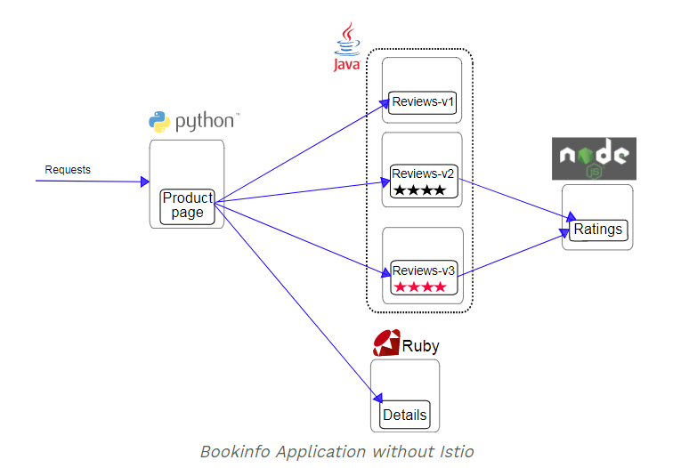
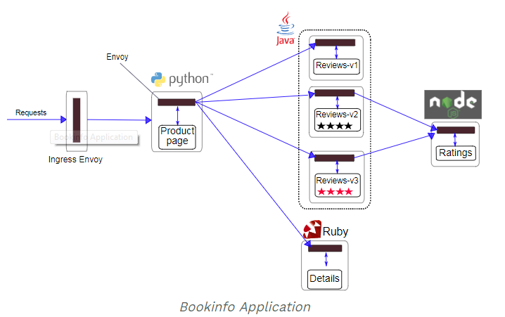

# 玩转K8S + Istio

## 搭建 K8S

### 环境准备

> CentOS 7 minimal ISO

install CentOS 7 minimal ISO on VMware Workstation Pro 12 :

	CPU： 2 Core
	Memory： 4G 
    Disk: 20G 
	Network： NAT

### 安装Linux

> 最小化安装，保持语言为英文

Setup Root Account and one sudo Account:

	root/123456
    mac/123456

Configure Host name and enable Ethernet: 
	
	master.k8s

查看内核版本：

	$ rpm -qa |grep kernel
	kernel-3.10.0-957.el7.x86_64
	kernel-tools-3.10.0-957.21.3.el7.x86_64
	kernel-3.10.0-957.21.3.el7.x86_64
	kernel-tools-libs-3.10.0-957.21.3.el7.x86_64

	$ uname -r
	3.10.0-957.21.3.el7.x86_64

	$ cat /etc/redhat-release
	CentOS Linux release 7.6.1810 (Core) 

Disable SELinux:

	# 查看SELinux的状态
	$ sestatus
	
	# 临时
	# setenforce 0
	
	# 永久
	# vi /etc/selinux/config 
	change: SELINUX=enforcing  
	as:
	SELINUX=permissive

> 也可以： 将其中的SELINUX=enforcing 改为 SELINUX=disabled

Disable Firewall

	# systemctl disable firewalld && systemctl stop firewalld
	Removed symlink /etc/systemd/system/multi-user.target.wants/firewalld.service.
	Removed symlink /etc/systemd/system/dbus-org.fedoraproject.FirewallD1.service.

### 安装Docker

	yum install -y docker 

测试Docker的版本：

	# docker version
	Client:
	 Version:         1.13.1
	 API version:     1.26
	 Package version: docker-1.13.1-96.gitb2f74b2.el7.centos.x86_64
	 Go version:      go1.10.3
	 Git commit:      b2f74b2/1.13.1
	 Built:           Wed May  1 14:55:20 2019
	 OS/Arch:         linux/amd64
	
	Server:
	 Version:         1.13.1
	 API version:     1.26 (minimum version 1.12)
	 Package version: docker-1.13.1-96.gitb2f74b2.el7.centos.x86_64
	 Go version:      go1.10.3
	 Git commit:      b2f74b2/1.13.1
	 Built:           Wed May  1 14:55:20 2019
	 OS/Arch:         linux/amd64
	 Experimental:    false
	[mac@master ~]$ 

将docker修改为国内镜像源

在/etc/docker/daemon.json文件中添加下面参数, 此处使用的是中国科技大学的docker镜像源

	{
	"registry-mirrors" : ["https://docker.mirrors.ustc.edu.cn"]
	}

没有该文件则自行创建, 最后重启docker服务

	$ sudo service docker restart

### 安装K8S

> 由于墙的原因无法直接访问到Google的软件仓库(packages.cloud.google.com)和容器仓库(gcr.io).

在YUM仓库中添加阿里云的K8S库

	cat <<EOF > /etc/yum.repos.d/kubernetes.repo
	[kubernetes]
	name=Kubernetes
	baseurl=http://mirrors.aliyun.com/kubernetes/yum/repos/kubernetes-el7-x86_64
	enabled=1
	gpgcheck=0
	repo_gpgcheck=0
	gpgkey=http://mirrors.aliyun.com/kubernetes/yum/doc/yum-key.gpg
	        http://mirrors.aliyun.com/kubernetes/yum/doc/rpm-package-key.gpg
	EOF

安装K8S需要的包 （1.13.8）：

    yum install -y kubelet kubeadm kubectl 
    yum install -y kubernetes-cni 

	$ kubectl version --short
	Client Version: v1.13.8
	Server Version: v1.13.8

安装后配置Docker服务和Kubelet服务：

    systemctl enable docker && systemctl start docker
    systemctl enable kubelet && systemctl start kubelet

启动net.bridge.bridge-nf-call-iptables内核选项：

	# sysctl -w net.bridge.bridge-nf-call-iptables=1
	net.bridge.bridge-nf-call-iptables = 1

	# echo "net.bridge.bridge-nf-call-iptables=1" > /etc/sysctl.d/k8s.conf

禁用交换分区：

	# swapoff -a && sed -i '/ swap / s/^/#/' /etc/fstab

使用kubeadm列出需要的镜像：

	# kubeadm config images list
	I0716 22:19:57.877284   44971 version.go:94] could not fetch a Kubernetes version from the internet: 
	unable to get URL "https://dl.k8s.io/release/stable-1.txt": Get https://dl.k8s.io/release/stable-1.txt: 
	net/http: request canceled while waiting for connection (Client.Timeout exceeded while awaiting headers)
	I0716 22:19:57.877575   44971 version.go:95] falling back to the local client version: v1.13.8
	k8s.gcr.io/kube-apiserver:v1.13.8
	k8s.gcr.io/kube-controller-manager:v1.13.8
	k8s.gcr.io/kube-scheduler:v1.13.8
	k8s.gcr.io/kube-proxy:v1.13.8
	k8s.gcr.io/pause:3.1
	k8s.gcr.io/etcd:3.2.24
	k8s.gcr.io/coredns:1.2.6

由于墙的原因，需要从阿里云上获得需要的镜像：

	docker pull registry.cn-hangzhou.aliyuncs.com/google_containers/kube-apiserver:v1.13.8
	docker pull registry.cn-hangzhou.aliyuncs.com/google_containers/kube-proxy:v1.13.8
	docker pull registry.cn-hangzhou.aliyuncs.com/google_containers/kube-scheduler:v1.13.8
	docker pull registry.cn-hangzhou.aliyuncs.com/google_containers/kube-controller-manager:v1.13.8
	docker pull registry.cn-hangzhou.aliyuncs.com/google_containers/coredns:1.2.6
	docker pull registry.cn-hangzhou.aliyuncs.com/google_containers/etcd:3.2.24
	docker pull registry.cn-hangzhou.aliyuncs.com/google_containers/pause:3.1

重新打谷歌的TAG：

	docker tag registry.cn-hangzhou.aliyuncs.com/google_containers/kube-apiserver:v1.13.8 k8s.gcr.io/kube-apiserver:v1.13.8
	docker tag registry.cn-hangzhou.aliyuncs.com/google_containers/kube-controller-manager:v1.13.8 k8s.gcr.io/kube-controller-manager:v1.13.8
	docker tag registry.cn-hangzhou.aliyuncs.com/google_containers/kube-scheduler:v1.13.8 k8s.gcr.io/kube-scheduler:v1.13.8
	docker tag registry.cn-hangzhou.aliyuncs.com/google_containers/kube-proxy:v1.13.8 k8s.gcr.io/kube-proxy:v1.13.8
	docker tag registry.cn-hangzhou.aliyuncs.com/google_containers/pause:3.1 k8s.gcr.io/pause:3.1
	docker tag registry.cn-hangzhou.aliyuncs.com/google_containers/etcd:3.2.24 k8s.gcr.io/etcd:3.2.24
	docker tag registry.cn-hangzhou.aliyuncs.com/google_containers/coredns:1.2.6 k8s.gcr.io/coredns:1.2.6

删掉阿里云的TAG：
	
	docker rmi registry.cn-hangzhou.aliyuncs.com/google_containers/kube-apiserver:v1.13.8
	docker rmi registry.cn-hangzhou.aliyuncs.com/google_containers/kube-proxy:v1.13.8
	docker rmi registry.cn-hangzhou.aliyuncs.com/google_containers/kube-scheduler:v1.13.8
	docker rmi registry.cn-hangzhou.aliyuncs.com/google_containers/kube-controller-manager:v1.13.8
	docker rmi registry.cn-hangzhou.aliyuncs.com/google_containers/coredns:1.2.6
	docker rmi registry.cn-hangzhou.aliyuncs.com/google_containers/etcd:3.2.24
	docker rmi registry.cn-hangzhou.aliyuncs.com/google_containers/pause:3.1

### 配置主节点

使用kubeadm配置主节点：

	# kubeadm init
	I0716 22:35:43.547406   11256 version.go:94] could not fetch a Kubernetes version from the internet: 
	unable to get URL "https://dl.k8s.io/release/stable-1.txt": Get https://dl.k8s.io/release/stable-1.txt: net/http: request canceled while waiting for connection (Client.Timeout exceeded while awaiting headers)
	I0716 22:35:43.547520   11256 version.go:95] falling back to the local client version: v1.13.8
	[init] Using Kubernetes version: v1.13.8
	[preflight] Running pre-flight checks
	[WARNING Hostname]: hostname "master.k8s" could not be reached
	[WARNING Hostname]: hostname "master.k8s": lookup master.k8s on 192.168.234.2:53: no such host
	[preflight] Pulling images required for setting up a Kubernetes cluster
	[preflight] This might take a minute or two, depending on the speed of your internet connection
	[preflight] You can also perform this action in beforehand using 'kubeadm config images pull'
	[kubelet-start] Writing kubelet environment file with flags to file "/var/lib/kubelet/kubeadm-flags.env"
	[kubelet-start] Writing kubelet configuration to file "/var/lib/kubelet/config.yaml"
	[kubelet-start] Activating the kubelet service
	[certs] Using certificateDir folder "/etc/kubernetes/pki"
	[certs] Generating "etcd/ca" certificate and key
	[certs] Generating "etcd/server" certificate and key
	[certs] etcd/server serving cert is signed for DNS names [master.k8s localhost] and IPs [192.168.234.131 127.0.0.1 ::1]
	[certs] Generating "etcd/healthcheck-client" certificate and key
	[certs] Generating "etcd/peer" certificate and key
	[certs] etcd/peer serving cert is signed for DNS names [master.k8s localhost] and IPs [192.168.234.131 127.0.0.1 ::1]
	[certs] Generating "apiserver-etcd-client" certificate and key
	[certs] Generating "ca" certificate and key
	[certs] Generating "apiserver-kubelet-client" certificate and key
	[certs] Generating "apiserver" certificate and key
	[certs] apiserver serving cert is signed for DNS names [master.k8s kubernetes kubernetes.default kubernetes.default.svc kubernetes.default.svc.cluster.local] and IPs [10.96.0.1 192.168.234.131]
	[certs] Generating "front-proxy-ca" certificate and key
	[certs] Generating "front-proxy-client" certificate and key
	[certs] Generating "sa" key and public key
	[kubeconfig] Using kubeconfig folder "/etc/kubernetes"
	[kubeconfig] Writing "admin.conf" kubeconfig file
	[kubeconfig] Writing "kubelet.conf" kubeconfig file
	[kubeconfig] Writing "controller-manager.conf" kubeconfig file
	[kubeconfig] Writing "scheduler.conf" kubeconfig file
	[control-plane] Using manifest folder "/etc/kubernetes/manifests"
	[control-plane] Creating static Pod manifest for "kube-apiserver"
	[control-plane] Creating static Pod manifest for "kube-controller-manager"
	[control-plane] Creating static Pod manifest for "kube-scheduler"
	[etcd] Creating static Pod manifest for local etcd in "/etc/kubernetes/manifests"
	[wait-control-plane] Waiting for the kubelet to boot up the control plane as static Pods from directory "/etc/kubernetes/manifests". This can take up to 4m0s
	[apiclient] All control plane components are healthy after 24.505143 seconds
	[uploadconfig] storing the configuration used in ConfigMap "kubeadm-config" in the "kube-system" Namespace
	[kubelet] Creating a ConfigMap "kubelet-config-1.13" in namespace kube-system with the configuration for the kubelets in the cluster
	[patchnode] Uploading the CRI Socket information "/var/run/dockershim.sock" to the Node API object "master.k8s" as an annotation
	[mark-control-plane] Marking the node master.k8s as control-plane by adding the label "node-role.kubernetes.io/master=''"
	[mark-control-plane] Marking the node master.k8s as control-plane by adding the taints [node-role.kubernetes.io/master:NoSchedule]
	[bootstrap-token] Using token: b2v19x.x34jhqj5jhzfgkpt
	[bootstrap-token] Configuring bootstrap tokens, cluster-info ConfigMap, RBAC Roles
	[bootstraptoken] configured RBAC rules to allow Node Bootstrap tokens to post CSRs in order for nodes to get long term certificate credentials
	[bootstraptoken] configured RBAC rules to allow the csrapprover controller automatically approve CSRs from a Node Bootstrap Token
	[bootstraptoken] configured RBAC rules to allow certificate rotation for all node client certificates in the cluster
	[bootstraptoken] creating the "cluster-info" ConfigMap in the "kube-public" namespace
	[addons] Applied essential addon: CoreDNS
	[addons] Applied essential addon: kube-proxy
	
	Your Kubernetes master has initialized successfully!
	
	To start using your cluster, you need to run the following as a regular user:
	
	mkdir -p $HOME/.kube
	sudo cp -i /etc/kubernetes/admin.conf $HOME/.kube/config
	sudo chown $(id -u):$(id -g) $HOME/.kube/config
	
	You should now deploy a pod network to the cluster.
	Run "kubectl apply -f [podnetwork].yaml" with one of the options listed at:
	https://kubernetes.io/docs/concepts/cluster-administration/addons/
	
	You can now join any number of machines by running the following on each node
	as root:
	
	kubeadm join 192.168.234.131:6443 --token b2v19x.x34jhqj5jhzfgkpt --discovery-token-ca-cert-hash sha256:5fdca9f2eb1a33a58b8ce5e052fb849288b7975038b104a4bc0d8f5d159d2af6

### 查看K8S的节点

普通用户执行如下：

	mkdir -p $HOME/.kube
	sudo cp -i /etc/kubernetes/admin.conf $HOME/.kube/config
	sudo chown $(id -u):$(id -g) $HOME/.kube/config
	export KUBECONFIG=~/.kube/config/admin.conf

	$ kubectl get nodes
	NAME         STATUS   ROLES    AGE   VERSION
	master.k8s   Ready    master   13h   v1.13.8

## 搭建 Istio

下载Istio进行手工安装:

	https://istio.io/docs/setup/kubernetes/#downloading-the-release

或者自动安装：

	curl -L https://git.io/getLatestIstio | ISTIO_VERSION=1.2.2 sh -

### 自动安装

	$ curl -L https://git.io/getLatestIstio | ISTIO_VERSION=1.2.2 sh -
	% Total    % Received % Xferd  Average Speed   Time    Time     Time  Current
	 Dload  Upload   Total   Spent    Left  Speed
	0     0    0     0    0     0      0      0 --:--:--  0:00:02 --:--:--     0
	100  2207  100  2207    0     0    463      0  0:00:04  0:00:04 --:--:--   894

	Downloading istio-1.2.2 from https://github.com/istio/istio/releases/download/1.2.2/istio-1.2.2-linux.tar.gz ...  
    % Total    % Received % Xferd  Average Speed   Time    Time     Time  Current Dload  Upload   Total   Spent    Left  Speed
	100   614    0   614    0     0    538      0 --:--:--  0:00:01 --:--:--   539
	100 20.2M  100 20.2M    0     0  17048      0  0:20:46  0:20:46 --:--:-- 16955
	Istio 1.2.2 Download Complete!

	Istio has been successfully downloaded into the istio-1.2.2 folder on your system.

	Next Steps:
	See https://istio.io/docs/setup/kubernetes/install/ to add Istio to your Kubernetes cluster.

	To configure the istioctl client tool for your workstation,
	add the /home/mac/istio-1.2.2/bin directory to your environment path variable with:
	export PATH="$PATH:/home/mac/istio-1.2.2/bin"
	
	Begin the Istio pre-installation verification check by running:
	istioctl verify-install 
	
	Need more information? Visit https://istio.io/docs/setup/kubernetes/install/ 

### 移步Istio安装目录

Move to the Istio package directory. For example, if the package is istio-1.2.2:

	cd istio-1.2.2

	$echo $PATH
	/usr/local/bin:/usr/bin:/usr/local/sbin:/usr/sbin:/home/mac/.local/bin:/home/mac/bin
	
	$ export PATH=$PWD/bin:$PATH
	$ echo $PATH
	/home/mac/istio-1.2.2/bin:/usr/local/bin:/usr/bin:/usr/local/sbin:/usr/sbin:/home/mac/.local/bin:/home/mac/bin

Begin the Istio pre-installation verification check by running:

	$ which istioctl
	~/istio-1.2.2/bin/istioctl

	$ istioctl verify-install 

	Checking the cluster to make sure it is ready for Istio installation...
	
	Kubernetes-api
	-----------------------
	Can initialize the Kubernetes client.
	Can query the Kubernetes API Server.
	
	Kubernetes-version
	-----------------------
	Istio is compatible with Kubernetes: v1.13.8.
	
	Istio-existence
	-----------------------
	Istio will be installed in the istio-system namespace.
	
	Kubernetes-setup
	-----------------------
	Can create necessary Kubernetes configurations: Namespace,ClusterRole,ClusterRoleBinding,CustomResourceDefinition,Role,ServiceAccount,Service,Deployments,ConfigMap. 
	
	SideCar-Injector
	-----------------------
	This Kubernetes cluster supports automatic sidecar injection. To enable automatic sidecar injection see https://istio.io/docs/setup/kubernetes/additional-setup/sidecar-injection/#deploying-an-app
	
	-----------------------
	Install Pre-Check passed! The cluster is ready for Istio installation.

### 查看Istio目录结构

	$ pwd
	/home/mac/istio-1.2.2
	
	$ ls
	bin  install  istio.VERSION  LICENSE  README.md  samples  tools

### 安装步骤

Install all the Istio Custom Resource Definitions (CRDs) using kubectl apply：

	$ for i in install/kubernetes/helm/istio-init/files/crd*yaml; do kubectl apply -f $i; done
	customresourcedefinition.apiextensions.k8s.io/virtualservices.networking.istio.io created
	customresourcedefinition.apiextensions.k8s.io/destinationrules.networking.istio.io created
	customresourcedefinition.apiextensions.k8s.io/serviceentries.networking.istio.io created
	customresourcedefinition.apiextensions.k8s.io/gateways.networking.istio.io created
	customresourcedefinition.apiextensions.k8s.io/envoyfilters.networking.istio.io created
	customresourcedefinition.apiextensions.k8s.io/clusterrbacconfigs.rbac.istio.io created
	customresourcedefinition.apiextensions.k8s.io/policies.authentication.istio.io created
	customresourcedefinition.apiextensions.k8s.io/meshpolicies.authentication.istio.io created
	customresourcedefinition.apiextensions.k8s.io/httpapispecbindings.config.istio.io created
	customresourcedefinition.apiextensions.k8s.io/httpapispecs.config.istio.io created
	customresourcedefinition.apiextensions.k8s.io/quotaspecbindings.config.istio.io created
	customresourcedefinition.apiextensions.k8s.io/quotaspecs.config.istio.io created
	customresourcedefinition.apiextensions.k8s.io/rules.config.istio.io created
	customresourcedefinition.apiextensions.k8s.io/attributemanifests.config.istio.io created
	customresourcedefinition.apiextensions.k8s.io/rbacconfigs.rbac.istio.io created
	customresourcedefinition.apiextensions.k8s.io/serviceroles.rbac.istio.io created
	customresourcedefinition.apiextensions.k8s.io/servicerolebindings.rbac.istio.io created
	customresourcedefinition.apiextensions.k8s.io/adapters.config.istio.io created
	customresourcedefinition.apiextensions.k8s.io/instances.config.istio.io created
	customresourcedefinition.apiextensions.k8s.io/templates.config.istio.io created
	customresourcedefinition.apiextensions.k8s.io/handlers.config.istio.io created
	customresourcedefinition.apiextensions.k8s.io/sidecars.networking.istio.io created
	customresourcedefinition.apiextensions.k8s.io/authorizationpolicies.rbac.istio.io created
	customresourcedefinition.apiextensions.k8s.io/clusterissuers.certmanager.k8s.io created
	customresourcedefinition.apiextensions.k8s.io/issuers.certmanager.k8s.io created
	customresourcedefinition.apiextensions.k8s.io/certificates.certmanager.k8s.io created
	customresourcedefinition.apiextensions.k8s.io/orders.certmanager.k8s.io created
	customresourcedefinition.apiextensions.k8s.io/challenges.certmanager.k8s.io created

Install one of the following variants of the demo profile：

	$ kubectl apply -f install/kubernetes/istio-demo.yaml
	namespace/istio-system created
	customresourcedefinition.apiextensions.k8s.io/virtualservices.networking.istio.io unchanged
	customresourcedefinition.apiextensions.k8s.io/destinationrules.networking.istio.io unchanged
	customresourcedefinition.apiextensions.k8s.io/serviceentries.networking.istio.io unchanged
	customresourcedefinition.apiextensions.k8s.io/gateways.networking.istio.io unchanged
	customresourcedefinition.apiextensions.k8s.io/envoyfilters.networking.istio.io unchanged
	customresourcedefinition.apiextensions.k8s.io/clusterrbacconfigs.rbac.istio.io unchanged
	customresourcedefinition.apiextensions.k8s.io/policies.authentication.istio.io unchanged
	customresourcedefinition.apiextensions.k8s.io/meshpolicies.authentication.istio.io unchanged
	customresourcedefinition.apiextensions.k8s.io/httpapispecbindings.config.istio.io unchanged
	customresourcedefinition.apiextensions.k8s.io/httpapispecs.config.istio.io unchanged
	customresourcedefinition.apiextensions.k8s.io/quotaspecbindings.config.istio.io unchanged
	customresourcedefinition.apiextensions.k8s.io/quotaspecs.config.istio.io unchanged
	customresourcedefinition.apiextensions.k8s.io/rules.config.istio.io unchanged
	customresourcedefinition.apiextensions.k8s.io/attributemanifests.config.istio.io unchanged
	customresourcedefinition.apiextensions.k8s.io/rbacconfigs.rbac.istio.io unchanged
	customresourcedefinition.apiextensions.k8s.io/serviceroles.rbac.istio.io unchanged
	customresourcedefinition.apiextensions.k8s.io/servicerolebindings.rbac.istio.io unchanged
	customresourcedefinition.apiextensions.k8s.io/adapters.config.istio.io unchanged
	customresourcedefinition.apiextensions.k8s.io/instances.config.istio.io unchanged
	customresourcedefinition.apiextensions.k8s.io/templates.config.istio.io unchanged
	customresourcedefinition.apiextensions.k8s.io/handlers.config.istio.io unchanged
	customresourcedefinition.apiextensions.k8s.io/sidecars.networking.istio.io unchanged
	customresourcedefinition.apiextensions.k8s.io/authorizationpolicies.rbac.istio.io unchanged
	customresourcedefinition.apiextensions.k8s.io/clusterissuers.certmanager.k8s.io unchanged
	customresourcedefinition.apiextensions.k8s.io/issuers.certmanager.k8s.io unchanged
	customresourcedefinition.apiextensions.k8s.io/certificates.certmanager.k8s.io unchanged
	customresourcedefinition.apiextensions.k8s.io/orders.certmanager.k8s.io unchanged
	customresourcedefinition.apiextensions.k8s.io/challenges.certmanager.k8s.io unchanged
	secret/kiali created
	configmap/istio-galley-configuration created
	configmap/istio-grafana-custom-resources created
	configmap/istio-grafana-configuration-dashboards-galley-dashboard created
	configmap/istio-grafana-configuration-dashboards-istio-mesh-dashboard created
	configmap/istio-grafana-configuration-dashboards-istio-performance-dashboard created
	configmap/istio-grafana-configuration-dashboards-istio-service-dashboard created
	configmap/istio-grafana-configuration-dashboards-istio-workload-dashboard created
	configmap/istio-grafana-configuration-dashboards-mixer-dashboard created
	configmap/istio-grafana-configuration-dashboards-pilot-dashboard created
	configmap/istio-grafana created
	configmap/kiali created
	configmap/prometheus created
	configmap/istio-security-custom-resources created
	configmap/istio created
	configmap/istio-sidecar-injector created
	serviceaccount/istio-galley-service-account created
	serviceaccount/istio-egressgateway-service-account created
	serviceaccount/istio-ingressgateway-service-account created
	serviceaccount/istio-grafana-post-install-account created
	clusterrole.rbac.authorization.k8s.io/istio-grafana-post-install-istio-system created
	clusterrolebinding.rbac.authorization.k8s.io/istio-grafana-post-install-role-binding-istio-system created
	job.batch/istio-grafana-post-install-1.2.2 created
	serviceaccount/kiali-service-account created
	serviceaccount/istio-mixer-service-account created
	serviceaccount/istio-pilot-service-account created
	serviceaccount/prometheus created
	serviceaccount/istio-cleanup-secrets-service-account created
	clusterrole.rbac.authorization.k8s.io/istio-cleanup-secrets-istio-system created
	clusterrolebinding.rbac.authorization.k8s.io/istio-cleanup-secrets-istio-system created
	job.batch/istio-cleanup-secrets-1.2.2 created
	serviceaccount/istio-security-post-install-account created
	clusterrole.rbac.authorization.k8s.io/istio-security-post-install-istio-system created
	clusterrolebinding.rbac.authorization.k8s.io/istio-security-post-install-role-binding-istio-system created
	job.batch/istio-security-post-install-1.2.2 created
	serviceaccount/istio-citadel-service-account created
	serviceaccount/istio-sidecar-injector-service-account created
	serviceaccount/istio-multi created
	clusterrole.rbac.authorization.k8s.io/istio-galley-istio-system created
	clusterrole.rbac.authorization.k8s.io/kiali created
	clusterrole.rbac.authorization.k8s.io/kiali-viewer created
	clusterrole.rbac.authorization.k8s.io/istio-mixer-istio-system created
	clusterrole.rbac.authorization.k8s.io/istio-pilot-istio-system created
	clusterrole.rbac.authorization.k8s.io/prometheus-istio-system created
	clusterrole.rbac.authorization.k8s.io/istio-citadel-istio-system created
	clusterrole.rbac.authorization.k8s.io/istio-sidecar-injector-istio-system created
	clusterrole.rbac.authorization.k8s.io/istio-reader created
	clusterrolebinding.rbac.authorization.k8s.io/istio-galley-admin-role-binding-istio-system created
	clusterrolebinding.rbac.authorization.k8s.io/istio-kiali-admin-role-binding-istio-system created
	clusterrolebinding.rbac.authorization.k8s.io/istio-mixer-admin-role-binding-istio-system created
	clusterrolebinding.rbac.authorization.k8s.io/istio-pilot-istio-system created
	clusterrolebinding.rbac.authorization.k8s.io/prometheus-istio-system created
	clusterrolebinding.rbac.authorization.k8s.io/istio-citadel-istio-system created
	clusterrolebinding.rbac.authorization.k8s.io/istio-sidecar-injector-admin-role-binding-istio-system created
	clusterrolebinding.rbac.authorization.k8s.io/istio-multi created
	role.rbac.authorization.k8s.io/istio-ingressgateway-sds created
	rolebinding.rbac.authorization.k8s.io/istio-ingressgateway-sds created
	service/istio-galley created
	service/istio-egressgateway created
	service/istio-ingressgateway created
	service/grafana created
	service/kiali created
	service/istio-policy created
	service/istio-telemetry created
	service/istio-pilot created
	service/prometheus created
	service/istio-citadel created
	service/istio-sidecar-injector created
	deployment.apps/istio-galley created
	deployment.apps/istio-egressgateway created
	deployment.apps/istio-ingressgateway created
	deployment.apps/grafana created
	deployment.apps/kiali created
	deployment.apps/istio-policy created
	deployment.apps/istio-telemetry created
	deployment.apps/istio-pilot created
	deployment.apps/prometheus created
	deployment.apps/istio-citadel created
	deployment.apps/istio-sidecar-injector created
	deployment.apps/istio-tracing created
	horizontalpodautoscaler.autoscaling/istio-egressgateway created
	horizontalpodautoscaler.autoscaling/istio-ingressgateway created
	horizontalpodautoscaler.autoscaling/istio-policy created
	horizontalpodautoscaler.autoscaling/istio-telemetry created
	horizontalpodautoscaler.autoscaling/istio-pilot created
	service/jaeger-query created
	service/jaeger-collector created
	service/jaeger-agent created
	service/zipkin created
	service/tracing created
	mutatingwebhookconfiguration.admissionregistration.k8s.io/istio-sidecar-injector created
	poddisruptionbudget.policy/istio-galley created
	poddisruptionbudget.policy/istio-egressgateway created
	poddisruptionbudget.policy/istio-ingressgateway created
	poddisruptionbudget.policy/istio-policy created
	poddisruptionbudget.policy/istio-telemetry created
	poddisruptionbudget.policy/istio-pilot created
	poddisruptionbudget.policy/istio-sidecar-injector created
	attributemanifest.config.istio.io/istioproxy created
	attributemanifest.config.istio.io/kubernetes created
	handler.config.istio.io/stdio created
	instance.config.istio.io/accesslog created
	instance.config.istio.io/tcpaccesslog created
	rule.config.istio.io/stdio created
	rule.config.istio.io/stdiotcp created
	instance.config.istio.io/requestcount created
	instance.config.istio.io/requestduration created
	instance.config.istio.io/requestsize created
	instance.config.istio.io/responsesize created
	instance.config.istio.io/tcpbytesent created
	instance.config.istio.io/tcpbytereceived created
	instance.config.istio.io/tcpconnectionsopened created
	instance.config.istio.io/tcpconnectionsclosed created
	handler.config.istio.io/prometheus created
	rule.config.istio.io/promhttp created
	rule.config.istio.io/promtcp created
	rule.config.istio.io/promtcpconnectionopen created
	rule.config.istio.io/promtcpconnectionclosed created
	handler.config.istio.io/kubernetesenv created
	rule.config.istio.io/kubeattrgenrulerule created
	rule.config.istio.io/tcpkubeattrgenrulerule created
	instance.config.istio.io/attributes created
	destinationrule.networking.istio.io/istio-policy created
	destinationrule.networking.istio.io/istio-telemetry created

### 验证安装

Ensure the following Kubernetes services are deployed and verify they all have an appropriate CLUSTER-IP except the jaeger-agent service：

	$ kubectl get svc -n istio-system
	NAME                     TYPE           CLUSTER-IP       EXTERNAL-IP   PORT(S)                                                                                                                                      AGE
	grafana                  ClusterIP      10.110.190.81    <none>        3000/TCP                                                                                                                                     5h50m
	istio-citadel            ClusterIP      10.104.184.236   <none>        8060/TCP,15014/TCP                                                                                                                           5h50m
	istio-egressgateway      ClusterIP      10.111.196.150   <none>        80/TCP,443/TCP,15443/TCP                                                                                                                     5h50m
	istio-galley             ClusterIP      10.98.29.220     <none>        443/TCP,15014/TCP,9901/TCP                                                                                                                   5h50m
	istio-ingressgateway     LoadBalancer   10.103.133.5     <pending>     15020:30493/TCP,80:31380/TCP,443:31390/TCP,31400:31400/TCP,15029:32228/TCP,15030:30344/TCP,15031:31932/TCP,15032:31000/TCP,15443:30865/TCP   5h50m
	istio-pilot              ClusterIP      10.105.189.123   <none>        15010/TCP,15011/TCP,8080/TCP,15014/TCP                                                                                                       5h50m
	istio-policy             ClusterIP      10.107.2.209     <none>        9091/TCP,15004/TCP,15014/TCP                                                                                                                 5h50m
	istio-sidecar-injector   ClusterIP      10.98.74.70      <none>        443/TCP                                                                                                                                      5h50m
	istio-telemetry          ClusterIP      10.98.20.199     <none>        9091/TCP,15004/TCP,15014/TCP,42422/TCP                                                                                                       5h50m
	jaeger-agent             ClusterIP      None             <none>        5775/UDP,6831/UDP,6832/UDP                                                                                                                   5h50m
	jaeger-collector         ClusterIP      10.99.89.162     <none>        14267/TCP,14268/TCP                                                                                                                          5h50m
	jaeger-query             ClusterIP      10.96.115.64     <none>        16686/TCP                                                                                                                                    5h50m
	kiali                    ClusterIP      10.100.222.86    <none>        20001/TCP                                                                                                                                    5h50m
	prometheus               ClusterIP      10.104.83.41     <none>        9090/TCP                                                                                                                                     5h50m
	tracing                  ClusterIP      10.106.74.180    <none>        80/TCP                                                                                                                                       5h50m
	zipkin                   ClusterIP      10.98.218.206    <none>        9411/TCP                                                                                                                                     5h50m

Ensure corresponding Kubernetes pods are deployed and have a STATUS of Running:

	$ kubectl get pods -n istio-system
	NAME                                      READY   STATUS      RESTARTS   AGE
	grafana-97fb6966d-w4trg                   1/1     Running     5          5h51m
	istio-citadel-7c7c5f5c99-rfnnt            1/1     Running     3          5h51m
	istio-cleanup-secrets-1.2.2-zrcl4         0/1     Completed   0          5h51m
	istio-egressgateway-f7b8cc667-flbf9       1/1     Running     5          5h51m
	istio-galley-585fc86678-srwjw             1/1     Running     3          5h51m
	istio-grafana-post-install-1.2.2-qjmw7    0/1     Completed   0          5h51m
	istio-ingressgateway-cfbf989b7-vxqs8      1/1     Running     5          5h51m
	istio-pilot-68f587df5d-7wzbl              2/2     Running     24         5h51m
	istio-policy-76cbcc4774-btfg8             2/2     Running     22         5h51m
	istio-security-post-install-1.2.2-928gp   0/1     Completed   0          5h51m
	istio-sidecar-injector-97f9878bc-st5zs    1/1     Running     3          5h51m
	istio-telemetry-5f4575974c-fjhs8          2/2     Running     24         5h51m
	istio-tracing-595796cf54-r64tg            1/1     Running     7          5h51m
	kiali-55fcfc86cc-jp5mn                    1/1     Running     5          5h51m
	prometheus-5679cb4dcd-tqk2q               1/1     Running     4          5h51m

### 查看K8S的变化

	$ kubectl get namespaces
	NAME           STATUS   AGE
	default        Active   13h
	istio-system   Active   32s
	kube-public    Active   13h
	kube-system    Active   13h

	$ kubectl get pods --all-namespaces

## 部署BookInfo

## 执行部署

Change directory to the root of the Istio installation.

	$ cd istio-1.2.2/
	$ pwd
	/home/mac/istio-1.2.2

The default Istio installation uses automatic sidecar injection. Label the namespace that will host the application with istio-injection=enabled:

	$ kubectl label namespace default istio-injection=enabled
	namespace/default labeled

Deploy your application using the kubectl command:

	$ kubectl apply -f samples/bookinfo/platform/kube/bookinfo.yaml
	service/details created
	serviceaccount/bookinfo-details created
	deployment.apps/details-v1 created
	service/ratings created
	serviceaccount/bookinfo-ratings created
	deployment.apps/ratings-v1 created
	service/reviews created
	serviceaccount/bookinfo-reviews created
	deployment.apps/reviews-v1 created
	deployment.apps/reviews-v2 created
	deployment.apps/reviews-v3 created
	service/productpage created
	serviceaccount/bookinfo-productpage created
	deployment.apps/productpage-v1 created

### 确认部署

Confirm all services and pods are correctly defined and running:
	
	$ kubectl get services
	NAME          TYPE        CLUSTER-IP       EXTERNAL-IP   PORT(S)    AGE
	kubernetes    ClusterIP   10.96.0.1        <none>        443/TCP    18h
	productpage   ClusterIP   10.110.122.148   <none>        9080/TCP   146m
	reviews       ClusterIP   10.98.76.49      <none>        9080/TCP   146m
	details       ClusterIP   10.108.84.119    <none>        9080/TCP   146m
	ratings       ClusterIP   10.97.171.177    <none>        9080/TCP   146m
	
	
	$ kubectl get pods
	NAME                              READY   STATUS    RESTARTS   AGE
	productpage-v1-6c668694dc-8w48b   2/2     Running   2          121m
	reviews-v1-597f899bf6-lkq2s       2/2     Running   2          150m
	reviews-v2-664994896d-rpxpb       2/2     Running   3          150m
	reviews-v3-fc984656d-95twf        2/2     Running   2          150m
	details-v1-7964b4bb49-kmq8r       2/2     Running   1          150m
	ratings-v1-7bb4dbd557-586hd       2/2     Running   2          150m

### 测试应用
	
	$ kubectl exec -it $(kubectl get pod -l app=ratings -o jsonpath='{.items[0].metadata.name}') -c ratings -- curl productpage:9080/productpage | grep -o "<title>.*</title>"
	<title>Simple Bookstore App</title>

## 暴露ingress的IP和端口

Determining the ingress IP and port

	$ kubectl get gateway
	No resources found.
	
	$ kubectl apply -f samples/bookinfo/networking/bookinfo-gateway.yaml
	gateway.networking.istio.io/bookinfo-gateway created
	virtualservice.networking.istio.io/bookinfo created
	
	$ kubectl get gateway
	NAME               AGE
	bookinfo-gateway   24s

	$ kubectl get svc istio-ingressgateway -n istio-system
	NAME                   TYPE           CLUSTER-IP     EXTERNAL-IP   PORT(S)                                                                                                                                      AGE
	istio-ingressgateway   LoadBalancer   10.103.133.5   <pending>     15020:30493/TCP,80:31380/TCP,443:31390/TCP,31400:31400/TCP,15029:32228/TCP,15030:30344/TCP,15031:31932/TCP,15032:31000/TCP,15443:30865/TCP   6h7m
	
Follow these instructions to set the INGRESS_HOST and INGRESS_PORT variables for accessing the gateway. Return here, when they are set.

	kubectl -n istio-system get service istio-ingressgateway -o jsonpath='{.spec.ports[?(@.name=="http2")].nodePort}'
	kubectl -n istio-system get service istio-ingressgateway -o jsonpath='{.spec.ports[?(@.name=="https")].nodePort}'

Set the ingress IP and ports (for nodePort):

	export INGRESS_PORT=$(kubectl -n istio-system get service istio-ingressgateway -o jsonpath='{.spec.ports[?(@.name=="http2")].nodePort}')
	export SECURE_INGRESS_PORT=$(kubectl -n istio-system get service istio-ingressgateway -o jsonpath='{.spec.ports[?(@.name=="https")].nodePort}')
	export INGRESS_HOST=$(kubectl get po -l istio=ingressgateway -n istio-system -o jsonpath='{.items[0].status.hostIP}')
	

### 使用网关测试

Proceed to Confirm the app is running, below.
	
	$ export GATEWAY_URL=$INGRESS_HOST:$INGRESS_PORT
	$ echo $GATEWAY_URL
	192.168.234.131:31380

	$ curl -s http://${GATEWAY_URL}/productpage | grep -o "<title>.*</title>"
	<title>Simple Bookstore App</title>

### 配置路由规则

Apply default destination rules

	$ kubectl get destinationrules
	No resources found.
	
	$ kubectl apply -f samples/bookinfo/networking/destination-rule-all.yaml
	destinationrule.networking.istio.io/productpage created
	destinationrule.networking.istio.io/reviews created
	destinationrule.networking.istio.io/ratings created
	destinationrule.networking.istio.io/details created
	
	$ kubectl get destinationrules
	NAME          HOST          AGE
	details       details       5s
	productpage   productpage   5s
	ratings       ratings       5s
	reviews       reviews       5s
	
	$ kubectl get virtualservices
	NAME       GATEWAYS             HOSTS   AGE
	bookinfo   [bookinfo-gateway]   [*]     14m
	[mac@master istio-1.2.2]$ 
	
	$ kubectl get gateway
	NAME               AGE
	bookinfo-gateway   14m

测试URL (图片仅供参考)：

http://192.168.234.131:31380/productpage

## 体验Istio的路由

### TODO: 体验1， 按版本路由

### TODO: 体验2， 按权重路由

## 体验Istio的生态圈

### 链路跟踪 Jaeger/Zipkin

端口转发

	$ kubectl get pod -n istio-system -l app=jaeger -o jsonpath='{.items[0].metadata.name}'
	istio-tracing-595796cf54-r64tg
	
	$ kubectl port-forward -n istio-system $(kubectl get pod -n istio-system -l app=jaeger -o jsonpath='{.items[0].metadata.name}') 16686:16686 &
	[1] 77439
	
	$ Forwarding from 127.0.0.1:16686 -> 16686
	Forwarding from [::1]:16686 -> 16686
	Handling connection for 16686
	Handling connection for 16686

新起终端，SSH二次转发

	$ ssh -N -f -L 0.0.0.0:16687:127.0.0.1:16686 mac@0.0.0.0
	The authenticity of host '0.0.0.0 (0.0.0.0)' can't be established.
	ECDSA key fingerprint is SHA256:7wd3UflBw3zdwGLXHVt31bIbrb+3NgK5cOy3uHSjXas.
	ECDSA key fingerprint is MD5:10:f7:1b:26:9e:e0:a4:41:b9:2d:69:c4:fc:ec:d8:dd.
	Are you sure you want to continue connecting (yes/no)? yes
	Warning: Permanently added '0.0.0.0' (ECDSA) to the list of known hosts.
	mac@0.0.0.0's password: 

测试URL：

	http://192.168.234.131:16687

### 分布式监控 prometheus

端口转发

	$ kubectl get pod -n istio-system -l app=prometheus -o jsonpath='{.items[0].metadata.name}'
	prometheus-5679cb4dcd-tqk2q[mac@master ~]$ 
	[mac@master ~]$ 
	[mac@master ~]$ kubectl port-forward -n istio-system $(kubectl get pod -n istio-system -l app=prometheus -o jsonpath='{.items[0].metadata.name}') 9090:9090 &
	[2] 108475
	[mac@master ~]$ Forwarding from 127.0.0.1:9090 -> 9090
	Forwarding from [::1]:9090 -> 9090
	Handling connection for 9090
	Handling connection for 9090
	
新起终端，SSH二次转发

	[mac@master ~]$ ssh -N -f -L 0.0.0.0:9091:127.0.0.1:9090 mac@0.0.0.0
	mac@0.0.0.0's password: 
	[mac@master ~]$ 

测试URL：

	http://192.168.234.131:9091/graph

### 监控大盘 grafana

查看服务：
	
	$ kubectl get svc grafana -n istio-system
	NAME      TYPE        CLUSTER-IP      EXTERNAL-IP   PORT(S)    AGE
	grafana   ClusterIP   10.110.190.81   <none>        3000/TCP   7h14m

端口转发

	$ kubectl get pod -n istio-system -l app=grafana -o jsonpath='{.items[0].metadata.name}'
	grafana-97fb6966d-w4trg
	
	$ kubectl port-forward -n istio-system $(kubectl get pod -n istio-system -l app=grafana -o jsonpath='{.items[0].metadata.name}') 3000:3000 &
	[3] 127492
	[mac@master ~]$ Forwarding from 127.0.0.1:3000 -> 3000
	Forwarding from [::1]:3000 -> 3000
	Handling connection for 3000
	Handling connection for 3000

新起终端，SSH二次转发

	ssh -N -f -L 0.0.0.0:3001:127.0.0.1:3000 mac@0.0.0.0
	mac@0.0.0.0's password: 

测试URL (图片仅供参考)：

	http://192.168.234.131:3001/

## 其他

### 卸载应用

Uninstall
	
	kubectl delete -f install/kubernetes/istio-demo.yaml
	for i in install/kubernetes/helm/istio-init/files/crd*yaml; do kubectl delete -f $i; done

### 列出所有的镜像

	$ docker images
	REPOSITORY                                         TAG                 IMAGE ID            CREATED             SIZE
	k8s.gcr.io/kube-proxy                              v1.13.8             fc646f895f69        9 days ago          80.2 MB
	k8s.gcr.io/kube-controller-manager                 v1.13.8             27fd887595e2        9 days ago          146 MB
	k8s.gcr.io/kube-apiserver                          v1.13.8             c7a13b5bbb1f        9 days ago          181 MB
	k8s.gcr.io/kube-scheduler                          v1.13.8             882281d60dda        9 days ago          79.6 MB
	k8s.gcr.io/coredns                                 1.2.6               f59dcacceff4        8 months ago        40 MB
	k8s.gcr.io/etcd                                    3.2.24              3cab8e1b9802        9 months ago        220 MB
	k8s.gcr.io/pause                                   3.1                 da86e6ba6ca1        19 months ago       742 kB
	docker.io/weaveworks/weave-kube                    2.5.2               f04a043bb67a        2 months ago        148 MB
	docker.io/weaveworks/weave-npc                     2.5.2               5ce48e0d813c        2 months ago        49.6 MB
	docker.io/istio/sidecar_injector                   1.2.2               e3ebf5c351d8        2 weeks ago         63.9 MB
	docker.io/istio/proxyv2                            1.2.2               a88eb4a4d7dd        2 weeks ago         370 MB
	docker.io/istio/proxy_init                         1.2.2               82789104df57        2 weeks ago         130 MB
	docker.io/istio/pilot                              1.2.2               c5404294359a        2 weeks ago         304 MB
	docker.io/istio/mixer                              1.2.2               b8477b2e4aaa        2 weeks ago         97.8 MB
	docker.io/istio/kubectl                            1.2.2               f77361d56dde        2 weeks ago         341 MB
	docker.io/istio/galley                             1.2.2               5825204a6579        2 weeks ago         307 MB
	docker.io/istio/citadel                            1.2.2               a6676b7a4f4e        2 weeks ago         68.5 MB
	quay.io/kiali/kiali                                v0.20               6ec37872298d        8 weeks ago         344 MB
	docker.io/jaegertracing/all-in-one                 1.9                 dbcbb85b2777        5 months ago        37.3 MB
	docker.io/grafana/grafana                          6.1.6               f96bf1723e2a        2 months ago        245 MB
	docker.io/prom/prometheus                          v2.8.0              f57ed0abd85c        4 months ago        109 MB
	docker.io/istio/examples-bookinfo-productpage-v1   1.12.0              8d63bf7b84f8        3 months ago        154 MB
	docker.io/istio/examples-bookinfo-reviews-v1       1.12.0              c98e8474b2d2        3 months ago        585 MB
	docker.io/istio/examples-bookinfo-reviews-v2       1.12.0              f08b11e6a70c        3 months ago        585 MB
	docker.io/istio/examples-bookinfo-reviews-v3       1.12.0              0cd9534dd570        3 months ago        585 MB
	docker.io/istio/examples-bookinfo-details-v1       1.12.0              2c1554c92121        6 months ago        259 MB
	docker.io/istio/examples-bookinfo-details-v2       1.12.0              d132e36c6c3b        6 months ago        259 MB
	docker.io/istio/examples-bookinfo-ratings-v1       1.12.0              7824b0333db5        3 months ago        218 MB
	docker.io/istio/examples-bookinfo-ratings-v2       1.12.0              0885c5238086        3 months ago        218 MB
	docker.io/istio/examples-bookinfo-mongodb          1.12.0              e95dd3ed7d66        6 months ago        383 MB
	docker.io/istio/examples-bookinfo-mysqldb          1.12.0              17fac651f942        6 months ago        343 MB

### backup images for k8s and istio

	docker save -o k8s.gcr.io_kube-proxy_v1.13.8.tar k8s.gcr.io/kube-proxy:v1.13.8
	docker load < k8s.gcr.io_kube-proxy_v1.13.8.tar
	...