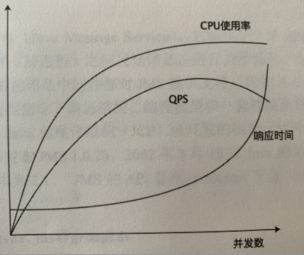

## 架构修炼之道 -- 读书笔记

### C01

### C02

### C03 分布式之道

#### 衡量性能的指标

指标：

- QPS Queries Per Second 查询量/秒
- TPS Transaction Per Second， 每秒事务处理数量
- RT, Response Time 响应时间，我们在使用时候一般用**平均响应时间**。
- 并发数： 系统能够同时处理的查询请求数量或事务数量。

响应时间由请求发送时间、网络传输时间和服务器处理时间三部分组成。

- 请求发送时间
- 网络传输时间
- 服务器处理时间

TPS和QPS的计算公式：

	TPS = 并发数 / 平均响应时间
	QPS = 并发数 / 平均响应时间

QPS、响应时间、并发数三者之间的关系如图：

由二八原则计算机器数量：

- 根据**二八原则**，系统流量也不例外，20%的时间承载流80%的流量。
- 线上系统每天80%的访问集中在20%的时间里，这20%时间叫：**峰值时间**。
- 利用这一点来评估系统扩容时候需要增加的机器。

公式如下：

	（总PV数 × 80%） / （每天秒数 × 20%） = 峰值时间内每秒请求数（QPS）
	 峰值时间内每秒请求数 / 单台机器的QPS  = 需要的机器

### C04 MQ之道

### C05

### C06